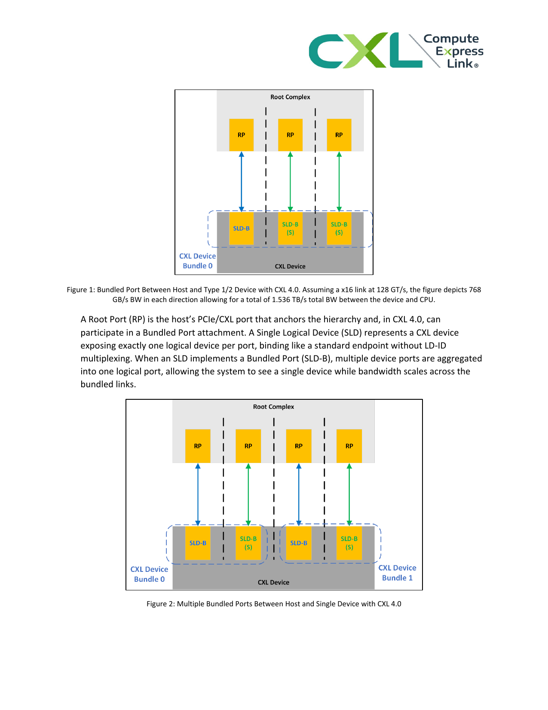

Updated: 2026-04-28

# Agentic AI 处理器趋势：从单芯片竞赛到 AI Control Plane 平台竞争

> Date boundary: 本文优先采纳 `2025-01-01` 及以后公开材料，事实状态以 `2026-04-28` 为准。  
> Scope: 本文关注 agentic inference / AI factory 场景下，处理器、互连与内存层级如何重写 `host CPU / control-plane CPU` 的角色；端侧 SoC、纯训练集群和远期市场份额预测仅作邻接参考。

## 执行摘要

- 参考 `assets/2027-2030 Agentic AI处理器技术演进趋势.pptx` 并核对一手资料后，当前最稳的结论不是“谁会在 2030 拿到更高份额”，而是：`agentic inference` 正把处理器竞争从单芯片性能推向 `CPU + state + interconnect + host memory hierarchy + infrastructure offload` 的平台组织能力。[1]
- `NVIDIA` 是当前证据最强的一条线。`Vera` 与 `Rubin` 的官方材料已经公开把 `agentic inference`、`data movement`、`control flow`、`test-time scaling` 和 AI factory 放进同一个平台叙事，CPU 被定义成高带宽 `data engine / control plane`，而不再只是 GPU 的外部宿主。[2][3][4]
- `开放路线` 也在成形，但成熟度明显低于 NVIDIA。`AMD + UALink + UCIe + CXL` 的强项在于开放互连、可组合性和 host-device 扩展能力，而不是已经形成同等闭环的整机平台。[5][6][7][8][9]
- 对这个主题而言，`HBM` 和某代 `GPU` 本身都不是主变量。它们最多只是平台背景条件，真正重要的是 `CPU 是否能成为更大的状态、内存和互连编排入口`。[2][3][8][9]
- 这份 `pptx` 里最弱的部分仍然是 `2030` 市场份额与市场规模数字。当前可以稳写的是公开规格、互连方向与平台组织方式；不能稳写的是 `RISC-V 10% -> 25%`、`x86 60% -> 40%` 或 `$295.5B` 之类未经同等级主来源核实的预测。[1]

## 1. 处理器趋势的关键变化：从“更强芯片”转向“更强 control plane”

把这份 deck 和本轮新补下来的官方材料放在一起看，最值得保留的核心命题只有一个：

> agentic 处理器趋势的核心，不是 CPU、GPU、NPU 各自如何演进，而是哪种平台最先把 `状态、互连、内存分层和基础设施旁路` 组织成可持续的 AI control plane。

原因并不抽象。agentic 负载不是一次性前向推理，而是更长上下文、更高 fan-out、更多外部状态对象和更多阶段切换的持续执行过程。平台瓶颈随之从纯算力扩散到 `data movement`、`control flow`、`memory hierarchy` 和 `orchestration`。[2][4]  
这也解释了为什么这份 deck 虽然对 `2030` 做了很多预测，但真正能被一手材料扎实支撑的，却主要是平台组织方式的变化，而不是远期份额结论。[1]

## 2. NVIDIA 已经把 CPU 明确推成 AI factory 的 data engine

`NVIDIA Vera CPU Delivers High Performance, Bandwidth, and Efficiency for AI Factories` 是当前最直接的 CPU 角色证据。它没有把 Vera 当成普通服务器 CPU 去描述，而是围绕 `agentic` 与 AI factory 场景给出指标：`88` 个 Olympus cores、`1.2TB/s` 内存带宽、`1.5x` sandbox performance，以及单机架 `4x` sandbox capacity。[2]

更关键的是 `Inside the NVIDIA Rubin Platform: Six New Chips, One AI Supercomputer` 对平台的定义方式。Rubin 不被写成“更强 GPU 搭配一个 CPU”，而是 CPU、GPU、DPU、NIC、switch、软件栈和冷却/供电的极限协同平台。文中明确把 Vera CPU 写成负责 `data movement`、`memory` 和 `control flow` 的高带宽执行引擎，并把 `agentic reasoning`、`long-context` 与 `test-time scaling` 列为平台的目标负载。[3]

`NVIDIA Vera Rubin Opens Agentic AI Frontier` 则把 `agentic inference` 进一步写入新闻稿级别的产品定位。这意味着“CPU 被前移为 control plane”并不是博客作者的个体解释，而是产品发布层面的正式叙事。[4]

图 1：Vera CPU 的高带宽和统一拓扑设计，说明 CPU 的目标是承接 AI factory 中的数据搬运和控制面职责，而非单纯延续传统通用 host CPU 逻辑。来源：NVIDIA Vera technical blog，2026-03-16。[2]

图 2：Rubin 平台把 CPU、GPU、DPU、NIC、switch 作为同一个系统写进平台图，说明竞争单位已经从“服务器”变成“AI factory 平台”。来源：Rubin 平台公开材料，2026-01。[3][4]

因此，这条线可以收敛成一个稳判断：  
**NVIDIA 已经不把 CPU 当成 GPU 服务器的配件，而是在把它推进成 AI factory 的第一层 control plane / data engine。**

## 3. 开放路线的焦点，不是复制封闭平台，而是互连与可组合性

`AMD` 当前的公开材料还没有形成 NVIDIA 那种高度闭环的平台叙事，但它已经在另一个方向上给出信号：开放 AI rack 需要更强的互连和 host-device 可组合能力。[5][6]

一方面，AMD 的公开表述已经把 `agentic AI` 所需的 `GPU + CPU + NIC` 协同、`Helios` 参考设计、`MI400 + Venice` 组合，以及 `UALink` 的开放 scale-up 路线放进同一组话语中。[5]  
另一方面，`UALink`、`UCIe` 与 `CXL 4.0` 这组标准材料把这种开放路线的技术底盘补得更具体：

- `UALink 1.0` 目标是单 pod `up to 1,024 accelerators`，`2.0` 还进一步引入了 `in-network compute`。[8]
- `UCIe` 已经把 package-level die-to-die 互连标准化，方便不同供应商的 chiplet 组合复用 PCIe/CXL 软件栈。[7]
- `CXL 4.0` 将链路速率推进到 `128GT/s`，引入 `Bundled Ports`，白皮书给出的单 x16 双向总带宽示例达到 `1.536TB/s`。[9]

图 3：CXL 4.0 的 Bundled Ports 将 host-device 带宽扩展和端口聚合制度化，这对未来 CPU 作为更大内存/状态编排入口具有直接意义。来源：CXL Consortium white paper，2025-11。[9]

这条开放路线当前最稳的结论不是“AMD 会赢”，而是：  
**如果 agentic inference 持续抬高状态对象的驻留、迁移、预取和复用成本，那么 CPU 能否继续充当系统中枢，将越来越取决于 `UALink / UCIe / CXL` 这类开放互连和内存扩展标准能否真正落地。**

## 4. 现在能稳写到哪一步，哪些结论还不能写满

截至 `2026-04-28`，以下结论可以稳写：

1. `NVIDIA` 已经公开把 CPU 推成面向 agentic AI factory 的 `data engine / control plane`。[2][3][4]
2. `开放路线` 已具备明确的互连与内存扩展基础，但平台闭环成熟度仍低于 NVIDIA。[5][6][7][8][9]
3. `CXL 4.0`、`UALink 1.0/2.0`、`UCIe` 都已经足够具体，可以支撑“平台组织方式正在变化”的判断。[7][8][9]

以下结论则暂时不能写满：

1. `RISC-V 10% -> 25%`、`x86 60% -> 40%` 这类份额预测，目前仍缺同等级一手支撑。[1]
2. `2030 $295.5B` 之类宏观市场数字，当前没有拿到足够强、可归档、可复核的主来源。[1]
3. 没有明确官方路线图支撑的远期单芯片参数预测，例如某家厂商到 `2030` 的具体核数或 `HBM5 4TB/s` 的确定交付状态。[1]

因此，参考这份 deck 去写正文时，最稳的方式不是复述 `2030` 愿景，而是抓住一个更强的命题：

> Agentic 处理器趋势的核心，不是 CPU、GPU、NPU 各自如何演进，而是哪种平台最先把 `状态、互连、host memory hierarchy 和基础设施旁路` 组织成可持续的 AI control plane。

## 参考资料

[1] `assets/2027-2030 Agentic AI处理器技术演进趋势.pptx`，二手综合 deck，作为搜索地图保留，不作为一手证据。  
[2] NVIDIA, *NVIDIA Vera CPU Delivers High Performance, Bandwidth, and Efficiency for AI Factories*, 2026-03-16. 本地 PDF: `cited-materials/agentic-processor-trends/t001-developer-nvidia-com-NVIDIA Vera CPU Delivers High Performance, Bandwid-2026-03-16.pdf`. 原始 URL: https://developer.nvidia.com/blog/nvidia-vera-cpu-delivers-high-performance-bandwidth-and-efficiency-for-ai-factories/  
[3] NVIDIA, *Inside the NVIDIA Rubin Platform: Six New Chips, One AI Supercomputer*, 2026-01-05. 本地 PDF: `cited-materials/agentic-processor-trends/t002-nvidia-rubin-platform-2026-01-05.pdf`. 原始 URL: https://developer.nvidia.com/blog/inside-the-nvidia-rubin-platform-six-new-chips-one-ai-supercomputer/  
[4] NVIDIA, *NVIDIA Vera Rubin Opens Agentic AI Frontier*, 2026-03-16. 本地 PDF: `cited-materials/agentic-processor-trends/t003-nvidia-vera-rubin-agentic-frontier-2026-03-16.pdf`. 原始 URL: https://nvidianews.nvidia.com/news/nvidia-vera-rubin-platform  
[5] AMD, *AMD Delivering Open Rack Scale AI Infrastructure to Unlock Agentic AI*, 2025-06-12. 原始 URL: https://www.amd.com/en/blogs/2025/amd-delivering-open-rack-scale-ai-infrastructure-to-unlock-agentic-ai.html  
[6] AMD, *AMD EPYC Server CPUs: Your Foundation for AI*. 本地 PDF: `cited-materials/agentic-processor-trends/t005-amd-epyc-foundation-for-ai-current.pdf`. 原始 URL: https://www.amd.com/en/products/processors/server/epyc/ai.html  
[7] UCIe Consortium, *Specifications*. 本地 PDF: `cited-materials/agentic-processor-trends/t007-ucie-specifications-current.pdf`. 原始 URL: https://www.uciexpress.org/specifications  
[8] UALink Consortium, *Specifications*. 本地 PDF: `cited-materials/agentic-processor-trends/t008-ualink-specifications-current.pdf`. 原始 URL: https://ualinkconsortium.org/specification/  
[9] CXL Consortium, *Introducing Compute Express Link CXL 4.0: Significant Improvements in Bandwidth, Connectivity, Memory Maintenance, and Security*, 2025-11. 本地 PDF: `cited-materials/agentic-processor-trends/t009-cxl-4-0-white-paper-2025-11.pdf`. 原始 URL: https://computeexpresslink.org/wp-content/uploads/2025/11/CXL_4.0-White-Paper_FINAL.pdf  
[10] Micron, *High-bandwidth memory (HBM)*. 本地 PDF: `cited-materials/agentic-processor-trends/t010-micron-hbm-current.pdf`. 原始 URL: https://www.micron.com/products/memory/hbm  
[11] SK hynix, *SK hynix Completes World’s First HBM4 Development and Readies Mass Production*, 2025-09-12. 本地 PDF: `cited-materials/agentic-processor-trends/t011-sk-hynix-hbm4-2025-09-12.pdf`. 原始 URL: https://news.skhynix.com/sk-hynix-completes-worlds-first-hbm4-development-and-readies-mass-production/
