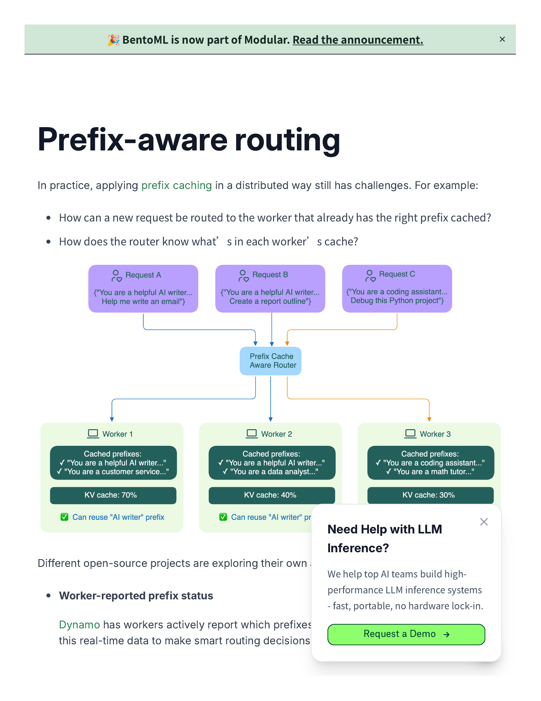

# S011 笔记：Prefix-aware routing

## 基本信息

- `source_id`：`S011`
- `direction_id`：`D12`
- 日期：`current`
- 类型：`handbook / systems guide`
- 本地材料：`cited-materials/s011-prefix-aware-routing.pdf`
- 提图状态：`completed`
- 可用图片数：`1`
- 图像来源目录：`assets/extracted-figures-all/S011`

## 与本课题的关系

这篇材料放到当前主题下的价值，不是孤立地讨论某个模型或系统技巧，而是帮助回答：**agentic AI 推理负载如何改变 AI CPU 作为大模型推理服务控制面的职责，重点只看 CPU 为推理请求服务的场景，不纳入工具调用沙箱本身的 CPU 消耗。**

就当前综述框架而言，它最直接补强的是：Prefix cache、cache affinity、retention 和 event-driven reuse，解释状态复用控制面如何形成。

## 核心判断

说明分布式 prefix cache 如何被路由层利用。

更具体地说，这篇材料对“agentic AI 推理负载如何改变 AI CPU 职责”的启发主要有三层：
1. 它说明了什么问题正在从 GPU 内部计算转移为 host/control-plane 问题：说明分布式 prefix cache 如何被路由层利用。
2. 它给出了哪类硬证据或定量迹象：worker-reported prefix status；consistent hashing；accurate/approximate router cache。
3. 它对工程判断的意义在于：CPU 不只是陪跑，而是在请求排队、状态放置、缓存复用、阶段切换或跨池协调中承担持续决策责任。

## 关键证据

- 主要用途：说明分布式 prefix cache 如何被路由层利用
- 关键证据/数据：worker-reported prefix status；consistent hashing；accurate/approximate router cache
- 建议回看原文时优先关注：`s011-prefix-aware-routing.pdf` 中与 `D12` 对应的图、表或系统示意。

## 图文笔记

### 图：`s011-prefix-aware-routing_page_0001-1.png`

这张图更适合用来看缓存命中、状态放置、路由倾向或内存层级设计。

结合本课题去读这张图时，建议重点看它是否揭示了以下至少一项：
- 控制面是否被前移到 CPU/host；
- 状态对象是否需要被保留、转移、预取或路由；
- 收益是否来自 dispatch、cache、bandwidth、placement 或 synchronization 的改善。

## 综述写作时可直接复用的提炼

- 对主线判断的贡献：说明分布式 prefix cache 如何被路由层利用。
- 最适合落在综述中的位置：`D12` 相关章节，用来支撑“Prefix cache、cache affinity、retention 和 event-driven reuse，解释状态复用控制面如何形成。”这一类论证。
- 与其他材料的拼接方式：可与同方向的论文、官方博客和反方材料并列使用，形成“机制 -> 真实工作负载 -> 平台/部署 -> 边界条件”的闭环。

## 当前状态

- 状态：`done`
- 是否含图：`yes`
- 下一步：如需进一步精修，可在这份笔记上补充更细的图注、页码和与其他材料的对照关系。
