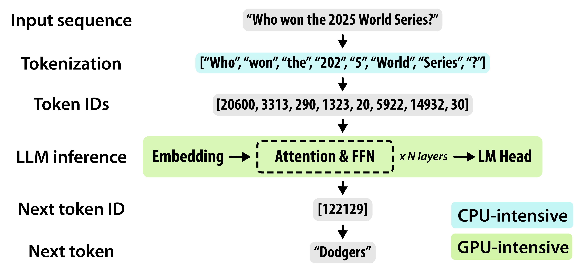
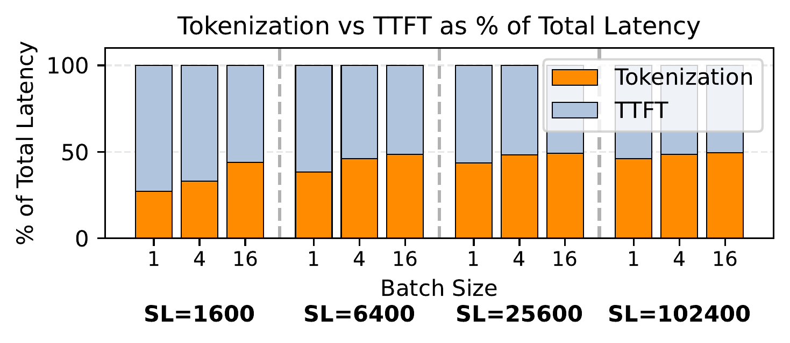
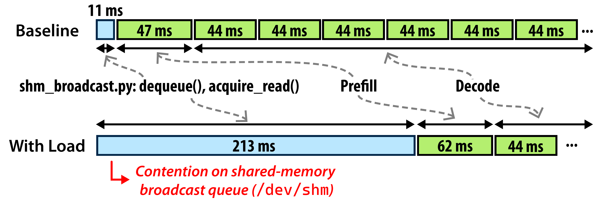
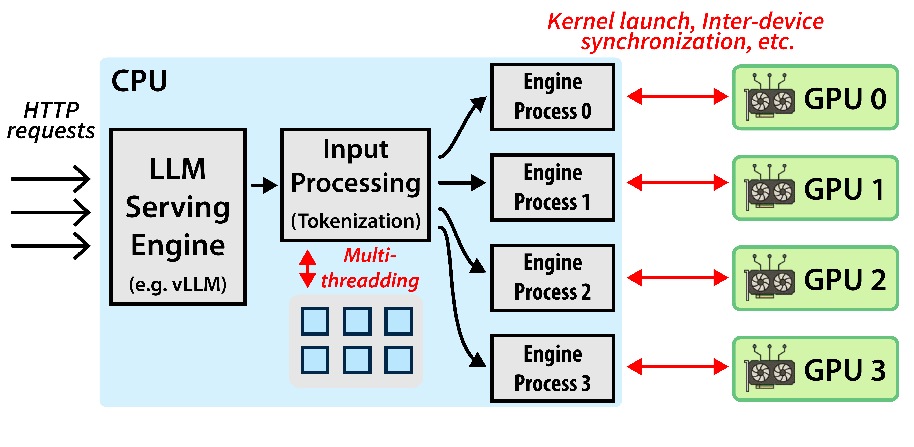
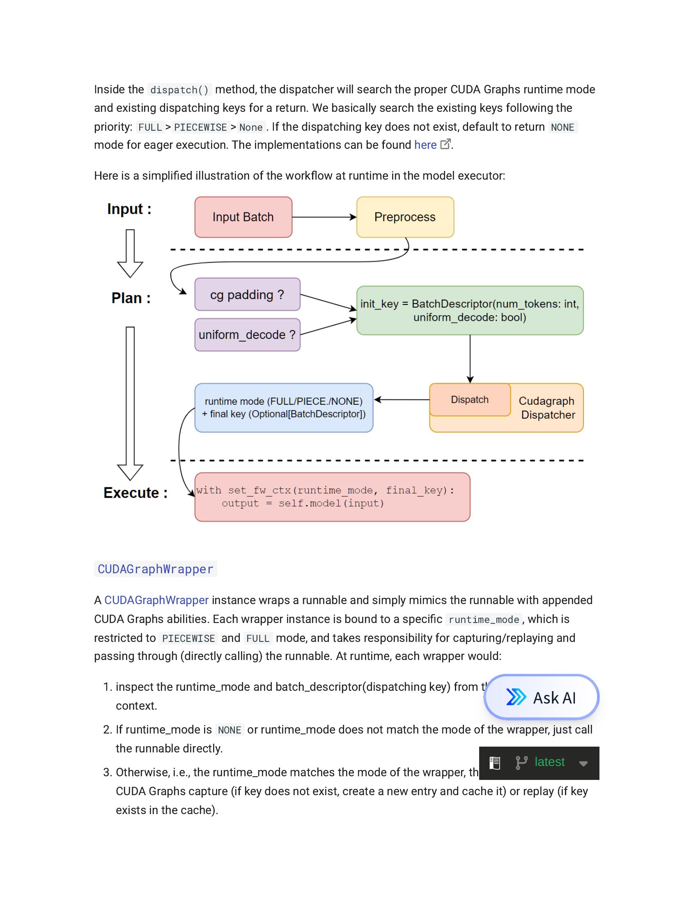

## 主线一子章节 1：微观问题：Kernel Launch Tax

父章节：`5. 主线一：算子下发为什么从 launch overhead 变成调度墙`

### 0. 判断-证据对齐表

| 判断 | 直接支撑材料 | 关键数字或图 |
| --- | --- | --- |
| launch tax 在小模型、量化模型和动态 serving 中会从背景噪声变成关键路径 | S005 (CPU slowdown); S038 (vLLM V1); S039 (CUDA Graphs); S040 (Event Tensor); **S049** (Vellaisamy ISPASS 25); **S053** (GraphMend) | `19x` dequeue amplification；`1.7x` throughput；`4x` CPU-bound region；TKLQT metric；graph break 导致 D2H 同步；graph capture / dynamic megakernel 图 |
| CPU slowdown 不是局部噪声，而会沿多 GPU 同步链被放大 | S005 (CPU slowdown) | `2603.22774_summary.png`、`2603.22774_sync-barrier.png` |
| 图化与 persistent runtime 的价值，来自减少反复的 host 提交动作，而不是单纯“编译更快” | S038 (vLLM V1); S039 (CUDA Graphs); S040 (Event Tensor); **S049** (kernel fusion proximity score); **S053** (GraphMend) | `piecewise CUDA graphs`、`FULL_AND_PIECEWISE`、`dynamic megakernels`；graph break 消除后 cold-start `-30%`~`-75%` |

### 1. 本章核心判断

在很多人仍把推理瓶颈理解成“矩阵算不够快”时，最新一批 serving 证据已经表明：  
**对小模型、量化模型和高度动态的批次来说，host-side kernel launch tax 已足以进入关键路径。** 这个判断并不是来自抽象直觉，而是已经被多 GPU slowdown 研究和 serving runtime 重构材料共同支撑：前者证明 host-side 微小抖动可以被同步链放大，后者证明减少 host 提交动作本身就能给系统带来可观收益。[1][2][3][4]

换句话说，dispatch 问题不是“有一点额外开销”，而是会在某些工作负载下决定单 token 时间预算。这里的 `tax` 指的是一种相对固定、与 GPU 实际有效计算量不成比例下降的控制开销；模型越小、阶段越碎，这笔“税”的占比反而越高。

### 2. CPU 在 LLM 推理中的三项职责与量化影响

在讨论 launch tax 为什么会被放大之前，有必要先回到 S005 给出的系统视角，明确 CPU 在 LLM 推理中到底承担了哪些 latency-sensitive 的工作。

#### 2.1 从 Fig. 2 看推理管线的 CPU/GPU 分工

> **图：** S005 给出的 LLM 推理管线概览。输入文本先经过 **CPU-intensive** 的 tokenization 和 detokenization，再进入 **GPU-intensive** 的 embedding → attention & FFN → LM Head 阶段。CPU 侧的预处理是 GPU 计算的前置条件，因此天然位于关键路径上。  
> 来源：*Characterizing CPU-Induced Slowdowns in Multi-GPU LLM Inference*, 2026-03.

这张图的价值在于：它把“CPU 只是 GPU 的陪跑”这一常见误解直接可视化。Tokenization、HTTP 请求处理、kernel launch 三件事虽然都不是矩阵乘法，但任何一件掉队，GPU 就会空等。

#### 2.2 Tokenization：长 prompt 与批量请求下的 CPU 杀手

Tokenization 把原始文本通过 BPE 或 SentencePiece 映射为 token IDs，是每一次推理请求的必经步骤。S005 的测量表明：

- **Tokenization 消耗大量 CPU cycles**，成本随输入长度线性增长；
- 在 Llama 3.1 8B（4×H200）上，tokenization 可占 TTFT 的 **up to 50%**；
- 现代 tokenizer（如 HuggingFace Tokenizers）默认启用 `TOKENIZERS_PARALLELISM=true`，通过 Rust 多线程加速子词分割和 Unicode 解析，但高并发时反而加剧 CPU core contention。

这意味着：在 agentic 场景下，如果输入是长上下文 prompt 或多模态截图 OCR 文本，tokenization 对 CPU 的瞬时压力会显著抬高整体延迟。

##### Fig. 5：Tokenization 占 TTFT 的比例随序列长度和 batch size 变化

> **图：** S005 Figure 5 给出的延迟分解。在 Llama 3.1 8B（4×H200）上，**CPU-side tokenization 最高可占 TTFT 的一半**。更关键的是，这一比例并不会因为序列变长而自动下降——因为现代 serving stack 使用 chunked prefill 和 FlashAttention，prefill 时间本身也随序列长度近线性增长，tokenization 因此始终是一个不可忽视的固定比例。  
> 来源：*Characterizing CPU-Induced Slowdowns in Multi-GPU LLM Inference*, 2026-03.

这张图提供了一个经常被忽略的时间视角：人们通常认为“模型前向传播（TTFT）才是大头”，但在长序列或高并发场景下，**tokenizer 的 CPU 预处理已经足以与 GPU 计算分庭抗礼**。S005 进一步指出，随着上下文长度继续增长（例如 1M token prompt），以当前吞吐率 tokenize 一次就可能需要数秒 CPU 时间；而由于 HuggingFace Tokenizers 默认启用多线程，core 不足时的线程调度延迟和上下文切换开销还会让绝对 tokenization 延迟再增加约 **5%**，TTFT 整体增加约 **10%**。

换句话说，tokenizer 性能不是一个可忽略的“前置小步骤”，而是一个**与输入长度线性挂钩、可占据端到端延迟一半的 CPU 密集型阶段**。

#### 2.3 HTTP 请求处理： query rate 决定可见度

HTTP server 负责连接管理、请求解析和批量调度。S005 指出，这类开销随 query rate 上升而非模型大小上升，通常在 500 RPS 以上才会与 tokenization 成本可比。因此，在大多数分析中，**tokenization 和 kernel launch 是更主要的 CPU 瓶颈来源**。

#### 2.4 Kernel launch overhead：从微秒到毫秒的放大器

CPU 需要通过 CUDA Runtime / Driver 栈为每一层模型调度 kernel，最终写入 GPU 的 doorbell register。S005 的诊断显示：

- 正常情况下，单次 kernel launch 的驱动开销在 **微秒级**；
- 一旦 host 线程因 OS 调度或 CPU core contention 被延迟，launch 延迟会被放大到 **毫秒级**；
- 在多 GPU 同步结构中，这种延迟不会只影响单个 rank，而会通过 barrier / broadcast 链拖累整组 GPU。

这正是后续章节中 `19x` dequeue amplification 和同步链放大效应的物理根源。

**这一判断得到了跨架构的独立验证。** Vellaisamy 等人（ISPASS 2025）在三种不同 CPU-GPU 耦合架构（AMD+A100 PCIe、Intel+H100 PCIe、GH200 NVLink-C2C）上通过细粒度 operator-to-kernel trace 测量了 kernel launch 和 queuing 行为，并提出 **TKLQT（Total Kernel Launch and Queuing Time）** 指标来精确区分 CPU-bound 与 GPU-bound 区域。[5] 他们的测量表明：

- nullKernel launch overhead 在 LC（PCIe）系统上约为 **2.3 μs**（AMD+A100: 2260.5 ns；Intel+H100: 2374.6 ns），GH200 由于 NVLink-C2C 更低；
- 在小 batch 的 **CPU-bound region**，TKLQT 保持恒定，此时延迟完全由 kernel launch overhead 主导，GPU 处于 under-utilized 状态；
- 随着 batch size 增大， workload 进入 **GPU-bound region**，TKLQT 才开始上升，因为 kernel queuing 成为主导因素。

TKLQT 的价值在于它把 "kernel launch tax" 从一个概念变成了**可直接从 profiler trace 中提取的量化指标**。它也比 prior work 的 "framework-bound vs compute-bound" 分类更精确，因为它直接锚定 CPU-GPU interaction 和 GPU saturation 的临界点。[5]

尤其值得注意的是 Vellaisamy 的一个反直觉发现：**即使 GH200 的 NVLink-C2C 提供了比 PCIe 更低的 kernel launch latency，CPU-bound 的 workload 并不能从中受益。** 原因是当 GPU 处于空闲状态时（CPU-bound region），更低的 launch latency 只是让 CPU 更快地发射到空的 GPU 队列里，不会转化为实际性能提升。GH200 的 Grace CPU（Arm Neoverse）single-thread 性能在 low-batch 场景下反而不如 x86 LC 系统中的 CPU，导致 GH200 在大 batch 下表现优异（Llama-3.2-1B prefill latency 快 1.9×–2.7×），但在 latency-sensitive 的 low-batch 场景下却可能落后。[5] 这一发现直接支持了 01 章节的核心判断：**硬件耦合更紧密并不能自动消除 launch tax，当 CPU 本身成为瓶颈时，降低 launch latency 的收益会被 CPU 执行能力的天花板抵消。**

#### 2.5 共享内存广播竞争：19× 放大的结构性瓶颈

S005 的 Figure 13 进一步把“launch tax 被同步链放大”从一个抽象推断变成了可被精确测量的结构性瓶颈。

> **图：** S005 Figure 13 展示共享内存广播队列（`/dev/shm`，vLLM `shm_broadcast.py`）上的竞争。Baseline 下 dequeue 仅约 **11 ms**，prefill 和 decode 分别约 47 ms 与 44 ms；但在 CPU 负载下，dequeue 被拖长到 **213 ms**，是 baseline 的 **~19×**。此时 dequeue 延迟（213 ms）已是 decode 计算步（44 ms）的 **近 5 倍**，CPU 控制面彻底主导了关键路径。  
> 来源：*Characterizing CPU-Induced Slowdowns in Multi-GPU LLM Inference*, 2026-03.

这个机制的关键在于 **1-writer-N-reader** 的共享内存广播队列结构：

- **Writer（调度器）** 必须等待所有 reader（GPU worker）完成 flag 更新才能继续；
- 当 CPU 被 tokenization 等负载占满时，reader 进程因 OS 调度被延迟，writer 只能自旋等待最慢的 reader；
- 竞争程度**与 tensor parallelism 度成比例**——TP=4 时需要轮询 4 个 reader flag，TP 越高，每轮等待的尾部延迟越大；
- LLM serving 的 **continuous batching** 要求每一步 decode 都做一次新的调度决策和广播，这意味着 IPC 开销会跨多个自回归迭代累积。

S005 的实验条件（H100，TP=4，5 RPS，100k-token 输入）并不极端，却能产生 **12 ms → 228 ms**（与图中 213 ms 对应同一量级）的 dequeue 延迟。这说明：

> **共享内存广播竞争不是“加几个 CPU core 就能完全消除”的 oversubscription 问题，而是 tensor parallelism 架构下 1-writer-N-reader 的结构性瓶颈。** 即使 CPU 核心充足，writer 仍需等待最慢 reader；而在多租户环境中，tokenization 和 IPC 轮询竞争同一组 CPU core，问题还会进一步恶化。

#### 2.6 量化影响：CPU 资源从稀缺到充足的收益

S005 通过系统性的 victim-attacker 实验给出了可量化的收益边界：

| 指标 | 数值 | 说明 |
| --- | --- | --- |
| TTFT 改善幅度 | **1.36–5.40×** | 从最少 CPU 配置（#GPUs + 1 cores）提升到 CPU-abundant 配置（2×–8× #GPUs cores） |
| CPU starvation 后果 | **频繁 timeout** | 中等负载下，CPU 不足的配置直接超时，而增加 CPU 即可恢复响应 |
| Tokenization 占 TTFT 比例 | **up to 50%** | 长序列场景下，预处理延迟与模型前向传播相当 |
| Dequeue 延迟放大 | **~19×** | 局部 host-side 排队通过同步链被放大到整组 GPU 的等待 |

这组数字的共同指向是：**CPU provisioning 不是“锦上添花”，而是决定多 GPU 系统能否把 GPU 算力兑现为实际吞吐的硬性前提。** 对 agentic workload 尤其如此，因为短片段、高频率的阶段切换会让 host-side 固定动作被反复执行到足以主导整体延迟。

#### 2.7 补充洞察：三张图其实说的是同一件事——CPU 从“前置条件”变成“结构性瓶颈”

把 S005 的 Figure 2、Figure 5 和 Figure 13 并置阅读，会发现它们不是三个孤立的发现，而是同一条因果链上的三个观测点：

| 图 | 观测位置 | 揭示的问题 |
| --- | --- | --- |
| **Fig. 2** | 推理管线全局 | CPU-intensive 的 tokenization 是 GPU-intensive 计算的前置条件；CPU 慢则整条管线慢 |
| **Fig. 5** | Tokenization 阶段 | 这个“前置条件”本身可以占 TTFT 的 50%，且比例不随序列增长而下降 |
| **Fig. 13** | 多 GPU 同步链 | 当 CPU 被 tokenization 占满时，共享内存广播队列的 dequeue 从 12 ms 放大到 228 ms（19×），成为整条链最慢的环节 |

**这条链的深层含义是：CPU 问题不是“某个阶段慢一点”，而是会在推理管线的不同阶段之间产生级联阻塞。**

- Tokenization（Fig. 5）把 CPU core 吃满 →
- Kernel launch 线程被 OS 调度延迟（§2.4）→
- 共享内存广播队列的 reader 进程响应变慢（Fig. 13）→
- Writer（调度器）自旋等待最慢 reader →
- 整组 GPU 在同步点空等 →
- 端到端延迟被放大 19×，而 GPU 利用率指标可能仍然“看起来正常”

这个级联过程的关键在于：**瓶颈会在 CPU 内部转移，但永远不会消失。** 你优化了 tokenization（例如 Rust 多线程），多出来的 core 可能被 kernel launch 和 IPC 轮询吃掉；你增加了 CPU core 缓解 oversubscription，1-writer-N-reader 的广播竞争仍然是结构性瓶颈（§2.5）。

对 agentic workload 而言，这个级联效应更危险，因为：

1. **阶段切换更频繁** → tokenization、scheduling、broadcast 被反复触发，累积成本不是线性而是超线性增长；
2. **Batch shape 更不稳定** → 无法通过一次性 warm-up 或静态图化把所有控制路径都 capture 住，host CPU 必须在每个 step 参与决策；
3. **长上下文更常见** → 1M token prompt 的 tokenization 可能消耗数秒 CPU 时间，直接把整条管线的前置阶段拖成瓶颈。

因此，S005 的三张图共同指向一个比“CPU 有点慢”更强的结论：

> **在多 GPU LLM serving 中，CPU 已经从“把请求送进去就完成任务”的辅助角色，转变为持续参与每一阶段推进的结构性瓶颈。优化 CPU 侧不再是边际增益，而是决定系统能否把 GPU 算力兑现为实际用户可见延迟的核心杠杆。**

### 3. 为什么小模型和量化模型反而更容易暴露 launch tax

这个结论看起来反直觉，因为很多人会以为模型越大、越复杂，CPU 越容易跟不上。  
但真正的情况恰好相反：

1. **模型越小，单次 GPU 计算时间越短**
   - 当一次 kernel 的有效计算时间缩短时，固定的 host 提交开销占比自然上升。

2. **量化越激进，越可能把原本的内存墙部分移开**
   - 一旦更多权重或中间状态能够驻留在更近的层级中，GPU 端的等待减少，CPU 端提交反而更显眼。

3. **动态 batch 会让同样的调度动作反复发生**
   - 服务化推理不是一次性批处理，而是持续进入、持续退出、持续切换的状态机。
   - 这意味着 host-side 的固定动作不是只做一次，而是持续做很多次。

因此，launch tax 的根源并不神秘：  
**它来自固定控制动作与越来越短的 GPU 执行片段之间的比例失衡。** 这一步仍带有机制推断色彩，但它是由前述 CPU slowdown 证据和 serving runtime 重构证据共同支撑的稳健推断。vLLM V1 把 persistent batch、piecewise CUDA graphs 和 prefix cache 等几件事同时推进，公开给出最高 `1.7x` 的 throughput 提升，本身就说明 host-side 调度和提交动作已经足够重，重构 runtime 可以直接改写系统结果，而不是只带来边角优化。[2]

Vellaisamy 的量化结果进一步支撑了这一点。他们在三种架构上测量了 encoder-only 模型（BERT, XLM-R）从 CPU-bound 到 GPU-bound 的转换点：

| 架构 | CPU-bound → GPU-bound 转换 batch size |
|------|----------------------------------------|
| AMD+A100 (PCIe) | ~8 |
| Intel+H100 (PCIe) | ~8 |
| GH200 (NVLink-C2C) | ~32 |

**GH200 的 CPU-bound region 比 LC 系统大 4×。** 这意味着在更紧密耦合的架构上，小模型 / 低 batch 场景反而更长时间地停留在 CPU-bound 区域——GPU 的高带宽让单步计算更快完成，但 CPU 发射下一批 kernel 的速度没有同比例提升，导致 GPU 更频繁地空闲等待。[5] 这个 4× 的放大不是来自 multi-GPU 同步链（Vellaisamy 是单 GPU 实验），而是来自**单 GPU 内部 CPU 发射能力与 GPU 执行能力之间的固有失衡**；当把它放回 S005 的多 GPU 同步链中时，这种失衡会被 broadcast/barrier 进一步放大。

### 4. 关键证据：为什么这个问题已经不是“感觉上的慢”

现有材料给出的最强信号主要来自两类。

#### 4.1 Runtime 层面的工程实测

工程 runtime 材料已经开始把“减少 host 发射次数”当成一等优化目标。vLLM V1 不是只优化某个 kernel，而是同时引入 persistent batch、zero-overhead prefix caching 和 piecewise CUDA graphs；Event Tensor 则更进一步，把动态 serving 过程压成 dynamic megakernels，从 runtime 结构上减少 host 不断发射细粒度工作项的需求。[2][4] 这类结果的重要性不在于某一张卡的绝对分数，而在于它们共同表明：

- dispatch 不是可以忽略的固定背景
- 它会在结构上限制系统

#### 4.2 CPU slowdown 论文的多 GPU 诊断

另一类证据更关键：它把“launch tax”从单机微观问题推进成了多 GPU 系统问题。  
因为一旦 CPU 线程抖动、排队或被抢占，launch 和队列延迟就会通过同步点放大。`Characterizing CPU-Induced Slowdowns in Multi-GPU LLM Inference` 给出的直接信号是：仅仅是 dequeue 延迟，就可能被同步链从 `12ms` 放大到 `228ms`，约 `19x`；而系统退化的成因常常不是 GPU 算不满，而是 host-side 没有及时把下一阶段工作送上去。[1] 这一组数字会在下一章被放回完整调度链中展开。
这说明 launch tax 不是孤立税费，而是会与：

- queue
- broadcast
- synchronization

一同组成更长的 host-side 关键路径。

### 图 1：CPU slowdown 为什么会被同步链放大

图 1 的独立结论是：只要多 GPU 协同结构存在，同步点就会把局部 host-side 排队和发射延迟放大成整批 GPU 都能感知的 slowdown。也因此，launch tax 很容易从微观开销演化成端到端瓶颈。[1]

### 5. 为什么 `CPU-induced slowdown` 是底层因果，而不是局部噪声

如果只把 CPU 慢看成“偶尔线程调度不好”，那就会低估这个问题。  
它真正危险的地方在于：

1. **它会被同步点放大**
   - 某一 rank 的 host 线程慢一点，不会只影响这一 rank，而会拖住整组协同计算。

2. **它会隐藏在 GPU 利用率指标后面**
   - GPU 低利用不一定说明 GPU 算得慢，也可能是 CPU 没来得及把下一步工作送上去。

3. **它会和服务栈额外开销叠加**
   - HTTP、scheduler、input prep、metadata handling 看起来都不是“计算”，但它们会一起吃掉 token 时间预算。

因此，把 `CPU-induced slowdown` 看成“噪声”是不对的。更准确的说法是：

> 它是 dispatch tax 在多线程、多 GPU、多队列系统里的放大器。[1]

### 6. 为什么这对 agentic workload 特别关键

agentic inference 让这个问题更糟，原因是它比普通 chat 更容易出现：

- 更短但更多的执行片段
- 更频繁的阶段切换
- 更高的状态管理动作密度
- 更不稳定的 batch shape

这些因素共同带来的效果是：  
即便 GPU 端单次计算不重，host-side 固定动作也会被重复执行到足以主导整体延迟。也正因如此，后续工业界优化才会集中到 persistent batch、piecewise/full graph capture 和更轻的 runtime path 上；否则单纯优化 GPU kernel，很难消掉这类由阶段切换和频繁发射动作累积出来的 host-side 税负。[2][3][4]

这一判断与 Vellaisamy 等人对 agentic AI 和 RAG 系统的分析完全一致。他们在论文中明确指出：agentic AI systems "consist of an LLM that orchestrates the coordinated behavior of multiple autonomous agents"，而 "the chaining of outputs and inputs across multiple models is expected to become more prevalent"。随着 pipeline 复杂度增加，"optimization techniques focused on minimizing latency, particularly between the CPU and GPU" 的需求会进一步被放大。[5] 这与 01 章节从微观 kernel launch tax 出发、最终指向 macro 调度墙的叙事形成了从单 GPU 诊断到多 GPU serving 的完整证据链。

### 7. 这对后续优化意味着什么

如果问题本质是“固定控制动作占比过高”，那么优化方向自然会落到：

- kernel fusion
- persistent batch
- piecewise/full graph capture
- persistent kernels
- 更轻的 scheduler / input path

也就是说，这个子章节会直接引向后面的两个问题：

- `03` 为什么要做 graphification，以及 piecewise / full / persistent 这几条路线分别在解决什么
- `04` 为什么不能只盯 GPU kernel，而要把收益、代价和 fallback 一起放进 runtime tradeoff 里

vLLM 的 CUDA Graphs 设计文档把这种取舍说得很清楚：服务化推理里并不是“能 capture 就全 capture”，而是在 `FULL_AND_PIECEWISE`、`FULL_DECODE_ONLY` 等模式间折中，因为完整图化虽然能显著压低 host launch 开销，但会带来 capture memory、warmup 和 dynamic fallback 的额外成本。[3] Event Tensor 则表明，另一条路线是把动态调度逻辑直接搬进 GPU runtime，通过 event-driven 的最小 host runtime 来进一步削弱 CPU 反复参与每个细粒度步骤的必要性。[4]

GraphMend 进一步补充了这条技术谱系的**左侧起点**：在考虑 runtime graph capture 之前，模型内部的控制流（数据依赖 `if/else`、Python I/O）已经足以让图碎片化。GraphMend 通过 `torch.where` 谓词化和 epilogue 副作用延迟两种源级变换，在不改变模型语义的前提下消除这些 break。[6] 这说明图化优化的收益不仅来自 runtime capture，也来自**编译器前端对 Python 动态性的预先消化**——host CPU 的参与可以在编译期就被部分消除，而不必等到 serving 时再每次重复处理。

### 图 2：图化 runtime 为什么能直接缓解 host launch tax

图 2 的独立结论是：服务化推理中的图化不是单一开关，而是多种 capture 粒度之间的折中。它支持本节的关键判断：当 host 提交已经进入关键路径时，系统会主动牺牲一部分灵活性和内存预算来减少每步 launch 动作。[3]

### 8. 小结

本节真正想说明的是：

> `Kernel Launch Tax` 不是一个孤立的低层细节，而是 agentic serving 中 CPU 进入关键路径的最直接微观入口。

当模型更轻、批次更动态、阶段更碎时，固定的 host-side 提交成本就会系统性抬高，进而把“launch overhead”演化成“调度墙”的第一块砖。`19x` 的 dequeue amplification、`4x` 的 CPU-bound region 扩大、`1.7x` 的 runtime 重构收益，graph break 消除带来的 `30%`~`75%` cold-start 改善，以及图化/megakernel 路线对 host runtime 的系统性压缩，共同说明这个问题已经不只是“微优化”，而是 agentic inference 时代 AI CPU 设计与 serving runtime 设计共同面对的微观起点。[1][2][3][4][5][6]

### 参考文献

[1] [Characterizing CPU-Induced Slowdowns in Multi-GPU LLM Inference](../material/reference-notes/s005-characterizing-cpu-induced-slowdowns-in-multi-gpu-llm-inference.md). 2026-03-25.

[2] [vLLM V1: A Major Upgrade with 1.7x Speedup](../material/reference-notes/s038-vllm-v1-a-major-upgrade-with-1-7x-speedup.md). 2025-01-27.

[3] [vLLM CUDA Graphs Design Document](../material/reference-notes/s039-vllm-cuda-graphs-design-document.md). current.

[4] [Event Tensor: Dynamic Megakernels for LLM Serving](../material/reference-notes/s040-event-tensor-dynamic-megakernels-for-llm-serving.md). 2026-04.

[5] [Characterizing and Optimizing LLM Inference Workloads on CPU-GPU Coupled Architectures](../material/reference-notes/s049-characterizing-optimizing-llm-inference-cpu-gpu-coupled-ispass25.md). ISPASS 2025, 2025-04-16.

[6] [GraphMend: Code Transformations for Fixing Graph Breaks in PyTorch 2](../material/reference-notes/s053-graphmend-fixing-pytorch-graph-breaks.md). 2025-09-17.
