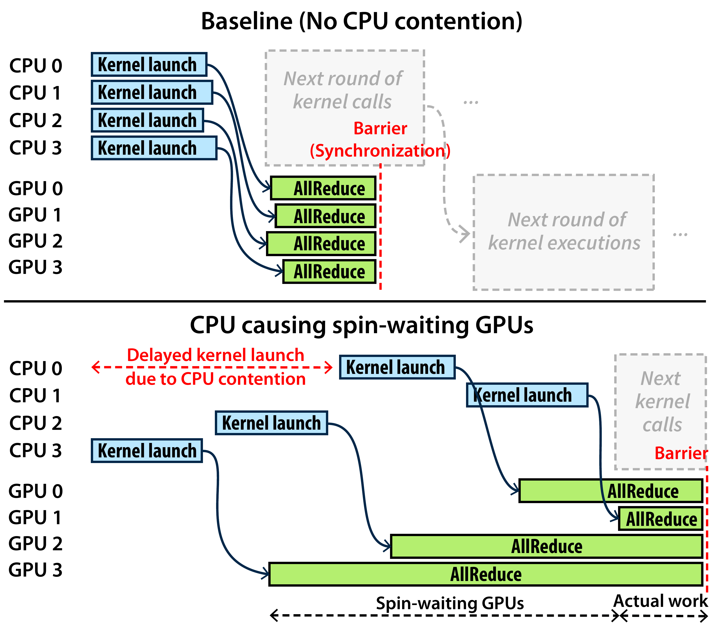
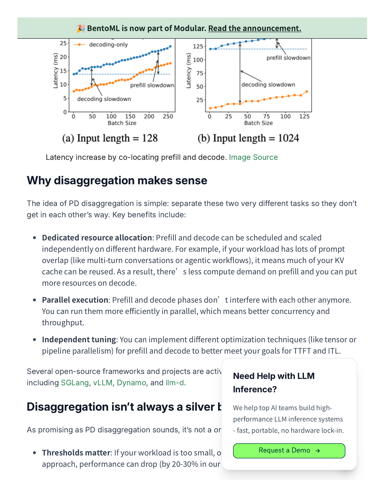

## 主线一子章节 2：宏观问题：状态驱动调度链

父章节：`5. 主线一：算子下发为什么从 launch overhead 变成调度墙`

01 已经说明单个 kernel launch tax 如何进入关键路径；本节进一步说明，这些微观 tax 一旦被 queue、selection、handoff 和 synchronization 串起来，就会升级成一堵真正的调度墙。

### 0. 判断-证据对齐表

| 判断 | 直接支撑材料 | 关键数字或图 |
| --- | --- | --- |
| 调度墙来自一整条 host-side 状态链，而不是单个 launch | S005 (CPU slowdown); S021 (PD disaggregation); S024 (Hidden bottlenecks) | `12ms -> 228ms` dequeue amplification；PD 分离结构图；hidden bottlenecks 图 |
| queue、worker selection、handoff、synchronization 会顺序放大彼此抖动 | S005 (CPU slowdown); S021 (PD disaggregation) | `2603.22774_sync-barrier.png`；`s021-prefill-decode-disaggregation_page_0002-2.png` |
| agentic workload 会把状态切换密度推高，因此更容易把 CPU 推到关键路径 | S021 (PD disaggregation); S024 (Hidden bottlenecks) | prefill compute-bound / decode memory-bound；额外 scheduling、KV management、streaming 开销 |

### 1. 本章核心判断

在 agentic inference 中，真正进入关键路径的常常不是单个 kernel launch，而是 **GPU 开始有效计算之前的一整条 host-side 状态驱动调度链**。这条链至少包括 `request ingress -> queueing -> worker selection -> broadcast / handoff -> synchronization -> state transition -> transfer / prefetch trigger`。只要这条链中的任一环节出现抖动，尾部同步点就会把前面“只慢一点”的控制动作放大成整批 GPU 都看得见的等待。[1][2]

因此，“调度墙”不是一个单点瓶颈，而是一串由 CPU 持续参与、顺序串联并彼此放大的控制动作。`S024`（DigitalOcean Hidden Bottlenecks）这类补充视角材料也没有否认这一点；它只是提醒我们，真实系统里除了 CPU 之外，tokenization、prompt preprocessing、KV management 和 streaming 也会一起争抢同一段前台时间预算。[3]

### 2. 为什么会从微观 launch 税升级成宏观调度墙

如果只看微观层面，kernel launch overhead 似乎只是每次提交几微秒的固定税费。但 agentic workload 会把它放大成系统问题，原因在于：

1. **阶段切换比传统 chat 更频繁**
   - 普通 chat 更接近单条请求连续 decode。
   - agentic inference 更常见的是 `prefill -> decode -> pause -> resume -> fan-out -> fan-in`。
   - `S021`（BentoML PD disaggregation 文档）明确把 prefill 和 decode 视为不同资源特性的阶段：前者更偏 compute-bound，后者更偏 memory-bound。这意味着 CPU 需要更频繁地推动 request state machine 跨阶段前进，而不是只在单一 steady-state decode 循环里提交工作。[2]

2. **控制动作比计算动作更碎**
   - 一个 agentic 请求常常不是“算完一个长序列”，而是不断在多个短阶段间切换。
   - 这会抬高 queue、worker selection、KV state tracking、broadcast 和 completion handling 的占比。`S024`（DigitalOcean Hidden Bottlenecks）把 scheduling、KV management 和 streaming 都列为实际部署中的隐性瓶颈，正说明控制面动作已经不再只是背景噪声。[3]

3. **多 GPU / 多 worker 会放大最慢一环**
   - 一旦进入 tensor parallel、expert parallel 或跨池 handoff，host-side 单点抖动会被同步点放大。
   - `S005`（CPU-induced slowdowns 论文）给出的直接证据是：高负载长上下文场景下，vLLM 的广播队列 dequeue 延迟可从 `12ms` 放大到 `228ms`，约 `19x`，也就是前一节所述的那组放大数字。这已经不是“调度有点慢”，而是 host-side queueing 反过来主导 GPU 何时能开始下一阶段工作。[1]

也就是说，kernel launch 本身只是入口；真正危险的是 **host-side sequencing cost** 开始累计并串联。

### 3. 证据链：为什么这不是纯理论推断

现有材料已经能提供三段较强的证据链。

第一段是 `S005`（CPU-induced slowdowns 论文）给出的底层因果。多 GPU serving 中，CPU 抖动并不会停留在局部，而是会通过同步链扩散成全局等待。`12ms -> 228ms` 的 dequeue 放大说明，host-side queueing 和 synchronization 足以反过来决定 GPU 有效利用率。[1]

第二段是 `S021`（BentoML PD disaggregation 文档）代表的解耦 serving 架构。当前公开文档已经把 `ingress router / prefill worker / decode worker` 视作可以显式拆开的角色，说明 CPU 需要管理的早已不只是本地 kernel 提交，而是跨阶段的 worker 进入顺序、handoff 时机和资源角色切换。[2]

第三段是 `S024`（DigitalOcean Hidden Bottlenecks）代表的工程边界条件。它指出系统瓶颈常常分散在 tokenization、prompt preprocessing、scheduling、KV management 和 streaming 等多个环节。这反而支持本文的核心判断：问题不是某个 launch 本身，而是整个 host-side execution loop 需要组织的状态动作越来越多。[3]

### 图 1：同步点为什么会把 host 抖动放大成全局等待

图 1 支持的不是一个抽象观点，而是具体的放大机制：当多个 rank 或 worker 需要在同一边界重新汇合时，队列抖动和 host 线程延迟会被同步点放大，最终表现成整批 GPU 的空等与尾延迟上升。[1]

### 4. queue、broadcast、synchronization、worker selection 为什么会相互放大

这四个环节并不是并列事项，而是一条顺序放大链。

#### 4.1 queue

queue 决定请求什么时候进入真正可执行状态。  
在 agentic 场景中，请求粒度更碎、状态切换更多，队列不再只是吞吐缓冲，而是阶段管理器。`S005`（CPU-induced slowdowns 论文）的结果说明，哪怕只是队列 dequeue 环节放慢，后续 GPU 批次也可能整体被拖住；`S024`（DigitalOcean Hidden Bottlenecks）则说明队列前面还有 tokenization 和 prompt preprocessing 这类 CPU 前处理，进一步增加了前台排队链的长度。[1][3]

#### 4.2 worker selection

worker selection 不只是“挑一张空闲 GPU”。  
在现代 serving 中，它至少要同时考虑：

- 当前阶段是 prefill 还是 decode
- prefix / KV locality
- current residency
- pool role
- topology
- fairness

`S021`（BentoML PD disaggregation 文档）之所以重要，是因为它把 prefill compute-bound、decode memory-bound 的差异公开化了。只要阶段角色不同，worker selection 就天然从“找空位”升级成“找最合适的执行路径”。选错路径，后面就会产生额外 handoff、warmup 或 KV miss。[2]

#### 4.3 broadcast / handoff

一旦请求跨 worker、跨 rank 或跨池移动，就需要显式广播或 handoff。  
这一步会把之前的 queueing 和 selection 结果变成真正的数据面动作。对于 PD 分离系统来说，handoff 还常常伴随 KV 元数据、阶段状态和优先级信息的传递，因此它不是“发个包就完”，而是一次显式的状态转移。[2] 如果 broadcast 路径慢、共享内存队列抖动、handoff metadata 大，之前做出的调度决策即使正确，也会在执行上失真。

#### 4.4 synchronization

synchronization 是整条链里最容易放大抖动的一环。  
原因很简单：它天然等待最慢的一方。于是 queue 慢一点、selection 多做一点、broadcast 抖一下，最终都会体现在 synchronization 上被放大。`S005`（CPU-induced slowdowns 论文）的核心价值就在这里，它证明多 GPU slowdown 的根本危险不是某次 launch 稍慢，而是同步边界会把局部 host 延迟升级成全局 stall。[1]

因此，这四个环节的关系不是“并列消耗”，而是：

> queue 决定排队形状，selection 决定执行路径，broadcast/handoff 决定数据面落地，synchronization 决定最慢路径如何拖累全局。

### 图 2：PD 分离为什么会把 worker selection 和 handoff 推到前台

图 2 的价值在于把“调度链”可视化了：当 ingress、prefill 和 decode 被拆成不同角色时，CPU 必须显式决定请求先进哪个池、何时切换阶段、如何交接状态对象。这说明 agentic serving 的 host 关键路径已经从单机 dispatch 扩展成跨角色控制链。[2]

### 5. 为什么 agentic workload 比传统 serving 更容易撞上这堵墙

传统 chat inference 的理想化假设通常是：

- 单上下文
- 长 decode
- 平滑批次
- 少状态分叉

但 agentic workload 恰好把这些假设逐条打破：

- `prefill-first`
- `session multiplicity`
- `fan-out / fan-in burst`
- `multimodal ingress`

其中：

- `prefill-first` 指 agentic 请求更容易被大量短 prompt、工具结果回填和分支上下文重组驱动，因此 prefill 占比常高于传统长对话。
- `session multiplicity` 指单个 agent 常同时维护多个工具调用、子任务或分支上下文，因此 CPU 需要同时管理多份会话状态。
- `fan-out / fan-in burst` 指一个 agent 可能瞬时拆出多个并发子请求，再把结果重新汇合，这会把 queue 与 selection 压力在短时间内放大。
- `multimodal ingress` 指图像、GUI 观测或工具返回结构化结果会持续改变输入 shape 和前处理链，进一步拉长 host-side 前台路径。

这些特征共同带来的结果是：CPU 参与的状态动作次数明显增加，而每次动作的收益窗口却更短。`S021`（BentoML PD disaggregation 文档）提供了阶段异构性这一结构性原因，`S024`（DigitalOcean Hidden Bottlenecks）则提供了实际工程中的额外前台开销清单。两者合起来说明，host-side 调度成本比传统单路 decode serving 更容易压过单次 GPU 计算收益。[2][3]

### 6. 对后续章节的衔接

这个子章节的结论会自然引向后面三条主线：

- 到 `KV lifecycle`，状态驱动调度链会变成状态对象的保留、恢复和路由问题。
- 到 `MoE`，这条链会进一步叠加 expert routing、residency 和 topology 组织。
- 到 `PD / Prefill-as-a-Service`，它会从单机 execution loop 演化成分布式 control plane。

### 7. 小结

本节最重要的结论不是“launch overhead 很贵”，而是：

> 在 agentic inference 中，CPU 进入关键路径的主要方式，是把原本分散的 queue、selection、handoff 和 synchronization 串成一条高频状态驱动调度链；GPU 计算只要略微变短或略微被切碎，这条链就会快速变成系统上限。

`12ms -> 228ms` 的 dequeue 放大、PD 分离下的显式角色切换，以及 scheduling/KV management/streaming 等额外控制动作，共同说明调度墙的本质不是某一个 launch 过慢，而是 host-side 状态链已经开始主导系统上限。[1][2][3]

### 参考文献

[1] Characterizing CPU-Induced Slowdowns in Multi-GPU LLM Inference. 2026-03-25.

[2] BentoML Handbook: Prefill-decode disaggregation. 2026/current.

[3] DigitalOcean: Hidden Bottlenecks in LLM Inference and How to Fix Them. 2026-04.
