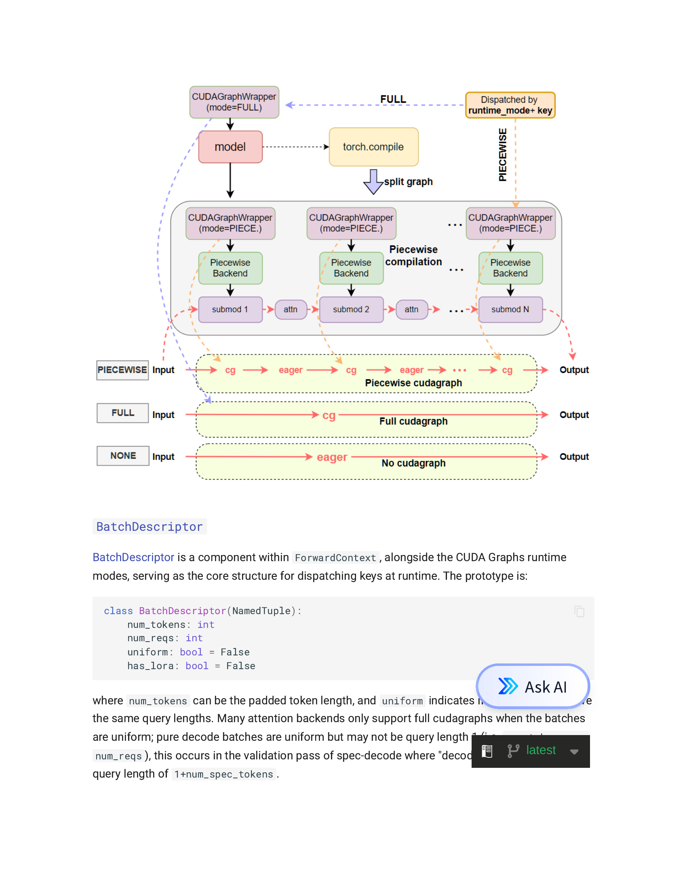
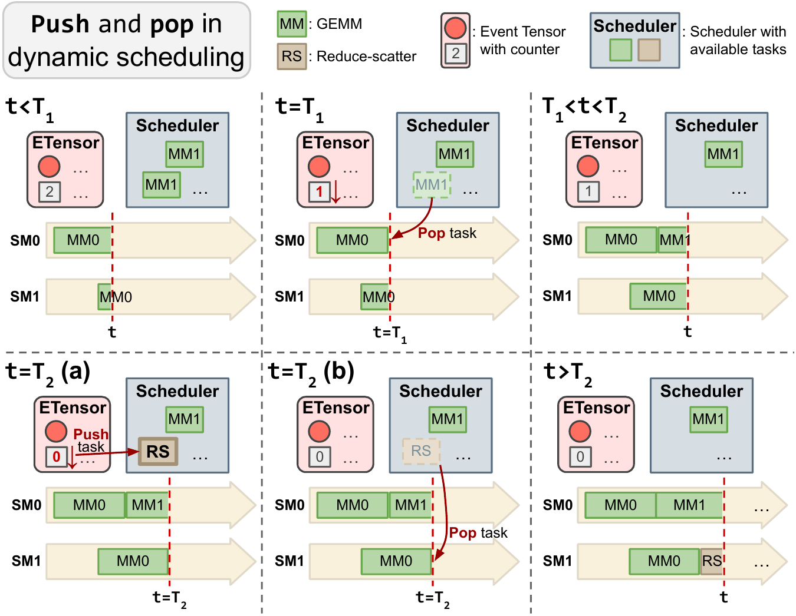

## 主线一子章节 3：图化编译与运行时图化

父章节：`5. 主线一：算子下发为什么从 launch overhead 变成调度墙`

既然调度墙来自 host-side 动作过多，一个自然的优化方向就是减少 host-side 的重复参与；图化编译正是这一方向在 serving runtime 中最核心的一组技术路线。

### 0. 判断-证据对齐表

| 判断 | 直接支撑材料 | 关键数字或图 |
| --- | --- | --- |
| 图化的核心价值是压低 host dispatch tax，而不是单纯“编译更优雅” | S038 (vLLM V1); S039 (CUDA Graphs); **S054** (Event Tensor) | `1.7x` throughput；piecewise CUDA graphs；dynamic megakernels；GEMM+RS `1.40x`；MoE `1.23x` |
| serving 里的图化必须和 runtime 一起设计，而不是离线一次编译完 | S039 (CUDA Graphs); **S054** (Event Tensor) | `FULL_AND_PIECEWISE`、`FULL_DECODE_ONLY`、static+dynamic scheduler、minimal runtime 图 |
| 激进路线会继续减少 host 参与，但会把复杂度转移到 capture、warmup 和 runtime materialization | S039 (CUDA Graphs); **S054** (Event Tensor) | compile/capture memory 开销；warmup `-3.5x`；minimal runtime 图；e2e compilation flow |

### 1. 本章核心判断

图化编译在服务化推理中的真正意义，不是“把几个 kernel 连起来”这么简单，而是：

> 通过提前结构化一部分执行路径，减少 host-side dispatch 和同步税。[1][2][3]

但只要进入真实 serving，这个问题就会立刻从编译问题变成 runtime 组织问题，因为 batch 是动态的、prefill 和 decode 是混合的、输入模态会变化、backend 可能不同，而且多租户下的 shape 与 state 会持续抖动。[2][3] 因此，图化在服务化推理里的核心矛盾是：**图越完整，稳态越快；图越完整，动态性越难容纳。**

这里先做一个极简定义。CUDA Graphs 是 NVIDIA 提供的一种执行机制，允许把一串 kernel 调用预先记录成可重放的执行图，后续通过更少的 host-side launch 重放整段序列，从而压低重复提交成本。本文用“图化”泛指所有通过预构建执行结构来减少 host-side dispatch 的技术，包括较保守的 CUDA Graph capture，也包括更激进的长生命周期执行结构。[2][3]

### 2. 为什么图化会在这个时间点重新变重要

图化编译并不是新概念，但它在 agentic inference 里重新变得重要，原因有三条。

第一，**如前一节所述，CPU dispatch tax 已经足够显性**。  
`S038`（vLLM V1 博客）给出的信号很直接：vLLM V1 把 persistent batch、zero-overhead prefix caching、scheduler path 和 piecewise CUDA graphs 一起重构后，吞吐最高可提升 `1.7x`。这里的重点不再是“问题是否存在”，而是既然 host-side execution loop 已足以改写端到端结果，图化就自然会重新变成现实的解决路线之一。[1]

第二，**状态驱动调度链太碎**。  
agentic workload 下，CPU 参与的动作更频繁，执行路径更容易出现大量小步控制开销。图化的现实作用，是把其中较稳定的一段“冻结”下来，减少每次重复提交。`S039`（vLLM CUDA Graphs 设计文档）之所以区分 `FULL_AND_PIECEWISE` 与 `FULL_DECODE_ONLY`，正是因为 serving 并不存在一个可以无条件全图覆盖的统一稳态。[2]

第三，**工业 serving 栈已经开始同时改 execution loop 和 capture 模式**。  
vLLM V1 没有把图化孤立出来讨论，而是把它和 runtime path 重构打包推进；`S054`（Event Tensor 论文，MLSsys 2026）则更进一步，尝试把动态 serving 的一部分直接组织成 dynamic megakernels，从结构上继续减少 host 反复发射细粒度工作项的需求。其关键创新在于 **tile-level dependency encoding**：将算子分解为 tile 级任务，任务间依赖编码为 event，既支持 shape dynamism（序列长度、batch size 变化），也支持 data-dependent dynamism（MoE routing、条件执行）。[1][3]

### 图 1：vLLM 为什么采用多模式 CUDA Graph 路线

> **图：** vLLM CUDA Graphs 设计文档中的模式对比。系统支持 **PIECEWISE**（cg 与 eager 交替）、**FULL**（全程 cuda graph）和 **NONE**（全程 eager）三种执行路径。PIECEWISE 通过 `torch.compile` 拆分子图并由 `PiecewiseBackend` 分块捕获，在保持动态性的同时降低 dispatch 税；FULL 则把整个模型包在 `CUDAGraphWrapper(mode=FULL)` 中，稳态最快但动态性最差。三种路径共存的设计说明 serving 图化不是一个单开关，而是一组需要 runtime 调度器根据 batch 特征动态选择的模式。[2]

图 1 的核心信息是：**系统要一边压低 dispatch tax，一边保留对动态 decode 路径的容错，因此更现实的做法是分层 capture，而不是假设所有请求都能稳定命中同一条 full graph。**

### 3. piecewise graphs、full graphs、persistent kernels 有什么根本差异

#### 3.1 piecewise CUDA Graphs

piecewise graph 的思路是：  
不强求把整条执行路径一次性固定，而是优先捕获那些相对稳定、收益显著的子图。`S038`（vLLM V1 博客）和 `S039`（vLLM CUDA Graphs 设计文档）共同说明，这条路线之所以先落地，是因为它在保持 runtime 可用性的同时，已经足以显著降低一部分 host 提交动作。[1][2]

它的优点是：

- 对动态 shape 更宽容
- 对 mixed prefill/decode 更友好
- 更容易和现有 runtime 共存

它的代价是：

- 不能完全消除 host-side sequencing
- 图外路径仍然需要 CPU 调度
- capture 边界设计不当时，收益会被来回切换吃掉

所以 piecewise graph 更像是 **runtime-compatible graphification**。

#### 3.2 full graphs

full graph 代表的是更激进的路线：  
尽量把完整执行路径固化下来，让 host-side 每次少做决定、少做提交。`S039`（vLLM CUDA Graphs 设计文档）的模式设计本身就说明 full graph 最适合结构稳定的阶段，尤其是 decode-only 这类重复路径；一旦请求偏离 capture 条件，就更容易退回 eager 或较保守的 piecewise 路径。[2]

它的收益最直接：

- dispatch tax 降得更明显
- steady-state path 更短
- GPU 侧更容易维持高利用率

但问题也很明显：

- 对动态 batch、动态 shape 和模态切换更敏感
- 一旦偏离 capture 条件，就更容易 fallback
- 需要更大的静态资源预留与 capture memory 预算

full graph 更适合结构稳定的阶段，但更难覆盖真实 agentic 请求的全貌。

#### 3.3 persistent kernels 与 megakernels

persistent kernel 走得更远。  
它的核心是让 GPU 端常驻一组更长寿命的执行实体，从而减少反复跨 kernel 边界的同步和 host 提交。megakernel 则更强调把原本分散的多个逻辑 kernel 合并进单个更大的物理执行体，以减少边界切换和调度次数。两者经常同时出现，但不完全等价：前者强调“长驻”，后者强调“融合”。`S054`（Event Tensor 论文）的 Event Tensor 就代表了这条更激进的方向：通过 `tile-level dependency encoding` 先把更细粒度的依赖关系编码出来，再在 runtime materialization 阶段把这些依赖实例化成更长生命周期的 `dynamic megakernels`。[3]

这里所谓 `runtime materialization`，并不是离线一次把所有路径都编好，而是在运行时根据当前可用的依赖关系和调度信息，把一段本来更动态的执行结构“压实”为可持续推进的执行体。这也是为什么 Event Tensor 比传统 CUDA Graph capture 更激进：它不只是重放既有图，而是试图把动态图本身的一部分组织进新的运行时结构里。[3]

Event Tensor Compiler (ETC) 基于 Apache TVM 构建，提供两种调度策略：
- **Static Scheduler**：对确定性任务图（如 All-Gather + GEMM ring 算法）预计算调度表，精确重叠通信与计算；
- **Dynamic Scheduler**：在 GPU SM 上运行轻量调度器，根据运行时 event 状态动态分配任务，适应网络竞争和负载波动。

在 8×B200 上的评估显示：
- GEMM + Reduce-Scatter 相比 cuBLAS+NCCL 顺序基线加速最高 `1.40x`；
- MoE layer 相比专用库加速最高 `1.23x`；
- engine warmup 开销相比 JIT/CUDA Graph 方案降低最高 `3.5x`；
- 动态 shape、低 batch serving 场景下，e2e 延迟达到 SOTA。

这条路的潜力很强，因为它可能进一步降低：

- kernel boundary synchronization
- host launch frequency
- 细碎 dispatch tax
- **运行时编译开销**（AOT 编译完全消除 runtime compilation 和 recapture 管理复杂度）

但它也意味着更强的前期结构化、更复杂的图构建和更高的系统工程门槛。[3]

### 图 2：Event Tensor 把动态图化推进到 runtime materialization

图 2 支持的关键判断是：激进路线不再满足于减少几次 host launch，而是尝试把动态依赖本身编码进更长寿命的执行结构里。这让 runtime-level graphification 与 persistent kernel 的边界开始模糊。[3]

### 4. 为什么说这不是单一编译问题，而是 runtime 组织问题

因为在服务化推理里，图从来不是脱离调度器独立存在的。  
它至少会和下面四件事深度耦合：

1. **scheduler**
   - 谁进图、谁不进图、何时 fallback，本质上都是调度问题。[2]

2. **batch formation**
   - batch 的 shape 是否稳定，决定图能否持续命中。[2]

3. **state reuse**
   - prefix / KV / session state 的存在会改变执行路径是否稳定；这也是为什么 vLLM V1 把 prefix caching 与 graph path 一起放进 runtime 重构叙事里。[1]

4. **backend selection**
   - attention backend、通信模式、MoE runtime 是否能兼容同一图路径，会直接决定 capture 边界能否长期成立。[2][3]

这就是为什么服务化图化编译的现实形态更接近：

> graph-aware runtime

而不是传统离线编译意义上的“图编译完成就结束”。

### 5. Event Tensor 代表了什么，为什么它重要

Event Tensor 的意义不只是“又有一篇更快的论文”，而是它把一个趋势推进得更清楚：

- 未来图化不一定只是在 host-side 捕获 CUDA Graph
- 也可能在 GPU 侧进一步把动态依赖组织成长生命周期执行结构

从综述视角看，Event Tensor 的价值在于：

1. 它说明 dispatch tax 问题已经严重到值得发明更激进的 execution form。[3]
2. 它说明 runtime-level graphification 和 kernel-level persistence 之间的边界正在模糊。[3]
3. 它提供了**真正的 AOT 编译**能力：动态 workload 不再需要运行时 JIT 编译或 CUDA Graph recapture——这对生产 serving 的冷启动和弹性扩缩容有直接影响。
4. 它让我们更容易看清工业界下一步可能怎么走：
   - 先用 vLLM 这类保守路径解决大部分问题
   - 再逐步吸收更激进的 persistent / megakernel 思路
   - 最终通过编译器下沉动态调度逻辑，把 host CPU 从每步发射中解放出来

### 6. 小结

图化编译在服务化推理中的关键变化是：

> 它已经不再只是离线编译优化，而是在和 scheduler、batch formation、state reuse、backend compatibility 一起构成新的 runtime 组织方式。

`1.7x` 的 runtime 重构收益、vLLM 的多模式 graph capture，以及 Event Tensor 的 dynamic megakernel 路线（GEMM+RS `1.40x`、MoE `1.23x`、warmup `-3.5x`），共同说明图化路线的本质不是“把图做得更大”，而是“在动态 serving 里找到哪些结构值得提前冻结，哪些部分必须继续交给控制面处理”。下一章会进一步讨论这些路线为什么有吸引力、也为什么必须付出代价。[1][2][3]

### 参考文献

[1] [vLLM V1: A Major Upgrade with 1.7x Speedup](../material/reference-notes/s038-vllm-v1-a-major-upgrade-with-1-7x-speedup.md). 2025-01-27.

[2] [vLLM CUDA Graphs Design Document](../material/reference-notes/s039-vllm-cuda-graphs-design-document.md). current.

[3] [Event Tensor: Dynamic Megakernels for LLM Serving](../material/reference-notes/s054-event-tensor-dynamic-megakernels.md). 2026-04-14.
