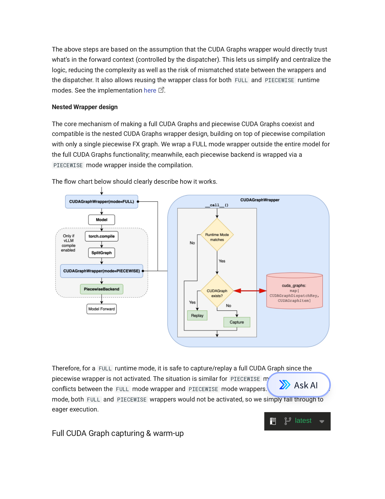
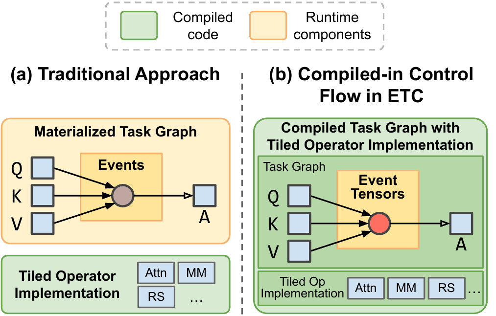

## 主线一子章节 4：图化编译在服务化推理中的利弊

父章节：`5. 主线一：算子下发为什么从 launch overhead 变成调度墙`

03 已经梳理了 piecewise、full 与更激进 runtime 路线的技术谱系；本节进一步讨论这些路线在服务化推理中的真实收益、真实代价，以及为什么工业界通常先选保守版。

### 0. 判断-证据对齐表

| 判断 | 直接支撑材料 | 关键数字或图 |
| --- | --- | --- |
| 图化的收益来自缩短稳态 dispatch 路径，而不是只减少几个 launch | S038 (vLLM V1); S039 (CUDA Graphs); **S053** (GraphMend) | `1.7x` throughput；graph break 消除后 cold-start `-30%`~`-75%`；多模式 CUDA Graph 图 |
| 图化的代价集中在 capture memory、warmup、fallback 和 backend 兼容性 | S039 (CUDA Graphs); S040 (Event Tensor); **S055** (PLaMo 2.0) | compile/capture memory；Mamba block 不兼容导致无法全图；dynamic schedule runtime；minimal runtime 图 |
| 工业界优先采用保守版，是因为 stateful inference 需要在吞吐、时延、成本与服务复杂度之间保留回旋空间 | S024 (Hidden bottlenecks); S025 (LLM trilemma); **S055** (PLaMo 2.0) | hidden bottlenecks；throughput / latency / cost trilemma；Mamba 仅编译 attention 的工业实践 |

### 1. 本章核心判断

图化编译在服务化推理中的确是有效武器，但它从来不是“只赚不赔”的优化。  
它的本质是：

> 用更高的前期结构化约束，去换更低的稳态 dispatch 开销。[1][2]

因此，图化路线的真正问题不是“值不值得做”，而是：

- 在哪些路径上值得做
- 需要付出哪些代价
- 为什么工业界更愿意先采用保守版

### 2. 收益为什么会这么明显

图化编译在服务化推理中的收益主要来自三个方面。

#### 2.1 降低重复提交税

这是最直观的一点。  
如果一段执行路径足够稳定，那么重复 capture 和重放比每次重新提交 kernel 更便宜。`S038`（vLLM V1 博客）的公开结果表明，vLLM V1 把 runtime path 与 piecewise CUDA graphs 一起重构后，吞吐最高可提升 `1.7x`，这说明减少前台 host 提交并不是理论收益，而是可见的系统级收益。[1]

**GraphMend**（S053）从编译器角度给出了互补的量化证据：在 8 个 Hugging Face 模型上，通过源级 AST 变换消除 graph break 后，cold-start forward 延迟降低 `30%`~`75%`，steady-state 延迟降低 `2.5%`~`25%`，end-to-end 吞吐提升 `5%`~`8%`。[6] 这组数字说明，即使在已有 serving runtime 之上，图化带来的收益仍可被独立测量和验证——它不是某个框架特有的 side effect。

#### 2.2 缩短 host-side sequencing path

图化不是只减少 launch 次数，它还减少了：

- 某些中间调度动作
- 某些重复的 runtime bookkeeping
- 某些 kernel 边界上的 host 参与

这会直接缩短前面章节讲到的状态驱动调度链。`S039`（vLLM CUDA Graphs 设计文档）对 graph modes 的拆分也说明，图化真正要压缩的是 `dispatch + sequencing + replay` 这条路径，而不只是 launch API 的调用次数。[2]

#### 2.3 让 steady-state path 更稳定

在持续 serving 中，最有价值的不只是平均更快，而是稳态更短、更 predictable。  
图化会让那部分可冻结路径更稳定，这对尾延迟和多租户可预测性都很重要。对 stateful inference 来说，这种可预测性本身就有运营价值，因为它决定了系统能否在多租户条件下维持稳定吞吐与时延分布。[2][4]

### 图 1：图化收益来自压缩可重复的 dispatch 路径

图 1 支持的关键判断是：图化收益不是“所有路径都更快”，而是系统把那些重复、稳定、值得冻结的路径优先纳入 graph capture，从而减少稳态 dispatch 成本。[2]

### 3. 代价为什么也必须写清

如果只讲收益，图化编译会显得像显然正确的答案；  
但在真实 serving 里，它至少会带来四类代价。

#### 3.1 capture memory tax

图化往往要求更静态、更明确的资源预留。  
这会直接抬高：

- 静态内存占用
- 预留空间
- 某些 shape 组合的资源浪费

对于多租户和高动态请求场景，这不是小问题。`S039`（vLLM CUDA Graphs 设计文档）已明确把 compile/capture memory 开销列为模式选择的一部分，而不是附带细节；这意味着图化从第一天起就和容量利用率发生交换。[2]

#### 3.2 warmup and compilation overhead

图不是白来的。  
首次 capture、图构建、shape 适配和预热都会消耗时间与资源。  
如果请求分布过于动态，系统可能还没吃到 steady-state 收益，就已经为图付出了很高的前期开销。`S040`（Event Tensor 论文）的路线虽然更激进，但同样暴露出 runtime materialization 与执行结构构建本身就是成本中心，而不是免费午餐。[3] 需要明确的是，当前公开材料对于这些代价的量化仍然明显少于收益量化，这本身也是工业界偏保守的重要原因之一。

#### 3.3 dynamic fallback

agentic workload 很容易触发：

- mixed prefill/decode
- shape 波动
- 多模态输入变化
- 不规则 batch

这些场景会迫使系统频繁 fallback 到 eager 或 piecewise 路线。  
一旦 fallback 过于频繁，图化收益就会被稀释，甚至被控制复杂度反噬。其机制成本不只是“走回 eager 路径”这么简单，还可能包括重新分配 eager buffer、放弃当前 capture 假设，并在下一轮继续判断是否还有重入 graph 路径的价值。`S039`（vLLM CUDA Graphs 设计文档）之所以把 `FULL_AND_PIECEWISE`、`FULL_DECODE_ONLY` 等模式明确区分出来，本质上就是在承认 fallback 频率会直接决定图化是否值得。[2]

**GraphMend** 进一步暴露了 fallback 的深层代价：每一次 graph break 不仅意味着 fallback to eager，还会引入**设备到主机（D2H）的内存同步**和**GPU 空闲等待**。在真实模型（如 Phi-4-mini）的 trace 中，graph break 前后的执行模式差异清晰可见——修复 break 后，原本分散的多个 compiled region 合并为单一连续 CUDA 区域，消除了中间的同步间隙。[6] 这说明 fallback 的隐性成本比"走回 eager"更高：它还在 CPU 和 GPU 之间制造了额外的握手边界。

#### 3.4 backend compatibility

不是所有 attention backend、通信模式、MoE runtime、定制 kernel 都能自然进入同一图路径。  
于是图化能力越激进，对 backend 和 runtime 一致性的要求越高。**PLaMo 2.0**（S055）的真实部署经验是这一判断的直接证据：在为 PLaMo 2.0-31B 配置 vLLM 时，由于 **Mamba block 与 `torch.compile` 不兼容**，团队不得不采用 **piecewise compilation**——仅对 attention 层启用 TorchInductor 编译，Mamba 层保留 eager mode。[7] 这说明 backend 兼容性不是理论约束，而是决定 capture 边界的硬性工程条件。

`S024`（DigitalOcean Hidden Bottlenecks）与 `S025`（DigitalOcean LLM Trilemma）的共同提醒是，stateful inference 的瓶颈和成本约束来自多个层面，图化不能脱离 backend、互连和服务复杂度单独评估。[4][5]

### 图 2：激进路线会把复杂度转移到 runtime materialization

图 2 说明更激进的路线确实能继续减少 host 参与，但代价是把更多动态性压到新的 runtime 结构里处理。它支持本节的核心判断：图化不是免费提速，而是复杂度重分配。[3]

### 4. 为什么工业界更愿意先采用保守版

这也是 vLLM 路径很有代表性的原因。  
工业界更偏好：

- piecewise graph
- gradual capture
- runtime-controlled fallback

而不是一步走到极端的全图化或更激进的 persistent megakernel 路线。

原因很现实：

1. 保守版更容易和现有 runtime 共存
2. 更容易对异常请求回退
3. 更容易逐步上线，而不是一次性替换执行模式

换句话说，工业界并不是不认可图化，而是优先选择 **兼容动态 serving 的图化**。`S025`（DigitalOcean LLM Trilemma）的 trilemma 视角尤其重要：它强调推理系统无法同时无限制地最大化 throughput、最小化 latency 并压低 cost；任何图化决策都必须在三者之间取舍，因此必须保留对异常请求、fallback 和资源波动的回旋余地。[5]

**PLaMo 2.0** 的实践进一步强化了这一判断：他们没有试图强制全图编译（这会导致 Mamba 层频繁 fallback 或完全失败），而是主动划定 capture 边界——attention 层内启用 `combo_kernels` 水平融合 Q/K normalization 等独立操作，Mamba 层则显式分离 prefill/decode 路径以适配 chunked prefill。[7] 这种"哪里能图化就图化，哪里不能就保留动态性"的策略，正是工业界保守路线的典型形态：它不追求理论最优的 full graph，而追求**在真实 backend 约束下最大化可图化区域的收益**。

### 5. 为什么 agentic workload 让这组 tradeoff 更尖锐

普通较稳定的推理服务，图化的收益和代价都更容易预测；  
agentic inference 则会把两边同时放大：

- 收益更大  
  因为 dispatch tax 更高、状态链更碎

- 代价也更大  
  因为 shape 更动态、模态更复杂、阶段切换更多

一个更具体的例子是：单轮 agent 循环可能在不到 `100ms` 到数百毫秒的窗口里经历 `prefill（用户输入） -> decode（生成 thought） -> decode（生成 action） -> pause（等待工具） -> prefill（工具结果回填） -> decode（继续生成）`。相比传统 chatbot 可以持续数秒的较稳定 decode，这种路径的稳态窗口更短、fallback 触发条件却更多，因此图化收益更可观，但 capture cost 也更难被摊薄。

**GraphMend** 的实验进一步量化了这一效应：当 graph break 落在热函数中间时，其破坏力最大；模型越小，CPU-GPU handoff 占 runtime 的比例越高，消除 break 的相对收益也越大。[6] 这与 agentic serving 的特征高度吻合——agent 循环中的大量短阶段、小模型子调用和不规则 batch，恰好是 graph break 破坏力最大的场景。

这意味着 agentic serving 对图化提出的不是“做不做”，而是：

> 如何精确划定哪些路径应图化、哪些路径必须保留动态性。[2][4][5]

### 6. 与后续主线的关系

图化编译不是孤立的。它会和后面的：

- prefix/KV reuse
- MoE routing
- PD disaggregation

一起决定 runtime 组织形态。  
状态越可复用、路径越可预测，图化越有价值；  
状态越分叉、路径越多变，fallback 和 capture tax 就越重要。

更具体地说：

- 到主线二，prefix cache 与 KV reuse 会直接影响 capture 路径的稳定性，复用率越高，图化越容易命中稳态路径。
- 到主线三，MoE 的 expert routing 动态性会直接冲击 full graph 的假设，因此 piecewise 路线往往更现实。
- 到主线四，PD 分离会把调度链从单机扩展到分布式 control plane，launch tax 又会叠加 handoff 与跨池同步成本。

### 7. 小结

本节最重要的结论是：

> 图化编译在服务化推理中的意义，从来不是“把图做大”，而是“在动态系统里选择性地冻结稳定路径”，从而用可控的结构化成本去换可观的 dispatch 收益。

`1.7x` 的运行时重构收益、graph break 消除带来的 `30%`~`75%` 延迟改善、capture memory / fallback 的现实代价，PLaMo 2.0 中 Mamba 层被迫保留 eager 的 backend 约束，以及 throughput / latency / cost 三角约束，共同说明它会成为 AI 机头 CPU 优化中的关键手段，却又永远不可能完全替代 runtime control plane。[1][2][5][6][7]

### 参考文献

[1] [vLLM V1: A Major Upgrade with 1.7x Speedup](../material/reference-notes/s038-vllm-v1-a-major-upgrade-with-1-7x-speedup.md). 2025-01-27.

[2] [vLLM CUDA Graphs Design Document](../material/reference-notes/s039-vllm-cuda-graphs-design-document.md). current.

[3] [Event Tensor: Dynamic Megakernels for LLM Serving](../material/reference-notes/s040-event-tensor-dynamic-megakernels-for-llm-serving.md). 2026-04.

[4] [DigitalOcean: Hidden Bottlenecks in LLM Inference and How to Fix Them](../material/reference-notes/s024-digitalocean-hidden-bottlenecks-in-llm-inference-and-how-to-fix-them.md). 2026-04.

[5] [DigitalOcean: The LLM Inference Trilemma](../material/reference-notes/s025-digitalocean-the-llm-inference-trilemma.md). 2026-04.

[6] [GraphMend: Code Transformations for Fixing Graph Breaks in PyTorch 2](../material/reference-notes/s053-graphmend-fixing-pytorch-graph-breaks.md). 2025-09-17.

[7] [PLaMo 2 Technical Report](../material/reference-notes/s055-plamo2-piecewise-compilation-vllm.md). 2025-09-05.
