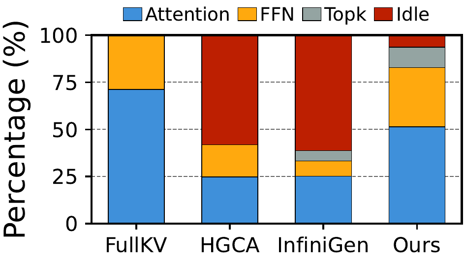
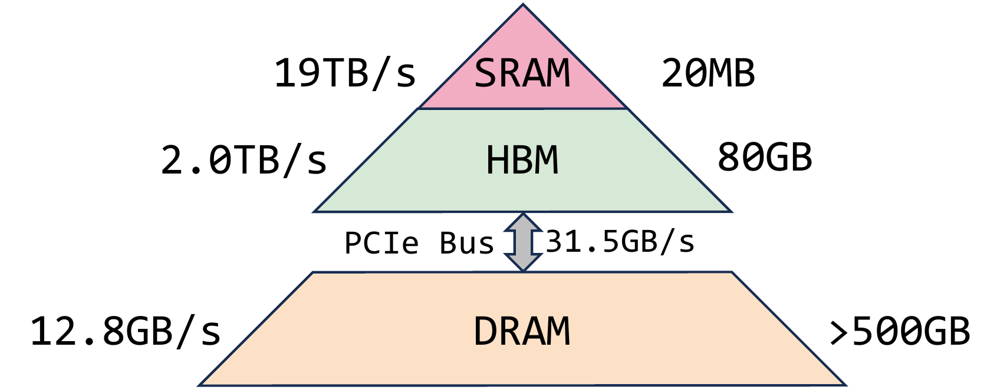

## 主线二子章节 1：从 KV Offload 到 KV Lifecycle

父章节：`6. 主线二：KV 不再只是容量对象，而是生命周期对象`

### 0. 判断-证据对齐表

| 判断 | 直接支撑材料 | 关键数字或图 |
| --- | --- | --- |
| agentic workload 的 KV 访问已从 write-heavy 转为 read-dominant，CPU 恢复动作的频率远超写入 | `S003 (NVIDIA Dynamo agentic)`；**S051** (Continuum) | read/write ratio `11.7x`；TTL pinning 减少跨轮重算 `1.12x`~`3.66x` |
| CPU 从单纯的 DMA 发起者前移到 layer-ahead 协同计算者，预计算与 GPU 执行重叠 | `S007 (ScoutAttention)` | 约 `2.1x` speedup；精度损失 `<2.4%` |
| KV 跨层级保留与恢复的成本结构取决于 CPU 的 placement 决策质量，而非仅靠带宽 | `S006 (NOSA)` | decode 吞吐最高 `2.3x`；selected KV transfer 仍可能主导成本 |
| 工业 serving 栈已将 retention、event API 和 token-range 策略硬化为 CPU 控制面职责 | `S034 (TensorRT-LLM KV reuse)`；**S051** (Continuum) | priority-based eviction；KV event API；tool-call aware TTL scheduling |

### 1. 本章核心判断

在 agentic inference 中，KV 已经不应被理解成"显存放不下时可以挪出去的一堆缓存"，而应被理解成一个**需要被长期保留、反复恢复、按价值调度的状态对象**。这个定义转变直接改写了 CPU 的职责边界：NVIDIA Dynamo 给出的 agentic 数据表明，KV 访问的读写比可以达到 `11.7x`，也就是同一段状态被读回和复用的频率远高于第一次写入。[1] 一旦读远多于写，系统优化目标就不会再停留在"能不能塞下"，而会转向"能不能在正确时间、正确层级、以正确代价把它拿回来"——这正是 CPU 控制面的新战场。

### 2. 为什么"容量问题"这个旧定义已经不够

早期 KV offload 的出发点很简单：上下文更长、批次更大、HBM 不够，于是把问题表述成"如何把 KV 搬到 CPU memory 或 storage"。但 `S006 (NOSA)` 和 `S007 (ScoutAttention)` 这类材料共同说明，真实瓶颈并不只是容量，而是**locality engineering 与 transfer domination**。

NOSA 的关键判断非常直接：决定收益的不是理论上保留了多少 token，而是 selected KV transfer 是否仍然主导成本；其公开结果是 decode throughput 最高可提升 `2.3x`。[2] 这说明即使稀疏访问减少了总搬运量，**CPU 的 placement 决策质量**（哪些块留在近端、哪些块提前拉回）才是收益能否兑现的关键。

ScoutAttention 则给出了更强的工程化证据：它不是只说"稀疏访问很好"，而是让 CPU 在 layer-ahead 阶段参与预计算，以便更早知道后续层需要哪些 KV，并提前准备恢复路径。公开结果是约 `2.1x` speedup，精度损失控制在 `<2.4%`。[3] 这说明 CPU 的价值不再只是开 DMA，而是在**预测、筛选和编排**将被访问的状态——从"搬运者"前移到"协同计算者"。

### 图 1：CPU layer-ahead 预计算与 GPU 执行的重叠效果

图 1 的意义在于把"CPU 前移"从概念落到时序上：layer-ahead 阶段 CPU 的预计算动作可以与 GPU 当前层计算并行，从而把恢复路径的延迟隐藏到关键路径之外。[3]

### 3. `write-once-read-many` 为什么会改写 CPU 的职责结构

agentic workload 下的大量状态都带有明显的 `write-once-read-many` 特征。system prompt、tool schema、session trunk、分支上下文和多代理共享前缀往往只在第一次 prefill 时完整写入，但在后续几十次请求里会被多次恢复。`S034 (TensorRT-LLM KV reuse)` 已经把这类现象工程化为 priority-based KV eviction、token-range retention 与 KV event API，说明工业界不再把 KV 当作"一次性中间结果"，而是把它视为需要显式治理的生命周期对象。[4]

**Continuum**（S051）从另一个维度强化了这一判断：在多轮 agentic workload 中，工具调用在 LLM 请求之间制造暂停，这些暂停会触发传统推理引擎的"回合结束即驱逐"策略，导致 KV cache 被逐出，后续轮次必须重新 prefill 或从 CPU DRAM 加载。Continuum 的解决方式不是简单"保留更多"，而是引入 **KV Cache Time-to-Live (TTL)** 机制：在检测到工具调用时，根据历史统计预测工具执行时长，为 KV cache 设置一个存活窗口，在此期间内保留于 GPU；若工具在 TTL 内返回，则直接 resume。评估显示，这一机制在 SWE-Bench 和 BFCL 上降低延迟 `1.12x`~`3.66x`，提升吞吐 `1.10x`~`3.22x`，在真实 SWE-agent 负载上最高降低延迟 `8.18x`。[5]

Continuum 的关键意义在于：它把 KV 生命周期管理从"系统内部策略"推进到**"工具感知调度决策"**——CPU 控制面必须理解 tool-call 语义、预测工具延迟、维护 program-level 状态，才能做出保留或驱逐的最优决策。这说明在 agentic 场景下，KV lifecycle 已经不仅是 capacity engineering，而是**workload-aware state orchestration**。

这个转变对 CPU 的职责结构有三层具体影响：

**第一层：状态 keeper 的计算负载。** CPU 需要维护哪些高价值块应继续驻留、哪些块已过期。这不再是简单的 LRU，而是需要按业务价值（token range、session 优先级、复用概率、工具延迟预测）做加权判断。TensorRT-LLM 的 priority-based eviction 和 pinned prefix 需求说明，CPU 的保留策略已经从"统一驱逐"变成"差异化治理"。[4] Continuum 的 TTL pinning 机制进一步细化了这一职责：调度器中的 Tool-Call Handler 必须实时解析工具调用、跟踪每类工具的历史延迟分布、计算 reload cost 与 ordering benefit 的平衡，才能为每轮工具调用输出最优 TTL。[5] 这意味着 state keeper 的计算负载已从"静态规则执行"升级为"动态预测与成本建模"。

**第二层：recovery planner 的决策复杂度。** 当 KV 需要在 HBM、CPU memory 和远端层级之间移动时，CPU 必须回答：从哪里恢复代价最低？预取能否隐藏在关键路径之外？resume 的粒度是 block 还是 token range？这些决策的复杂度直接随层级数和状态分叉数增长。

**第三层：prefetch trigger 的时序敏感性。** ScoutAttention 的 layer-ahead 机制表明，预取不是"提前搬回来"这么简单，而是要在 GPU 计算当前层的同时，CPU 提前计算下一层的访问模式并准备数据。这要求 CPU 与 GPU 之间建立更紧密的流水线同步，而不是传统的"GPU 算完 CPU 再搬"的串行模型。[3]

### 图 2：KV 跨层级生命周期把 CPU 推向状态治理中心

图 2 支撑的核心判断是：一旦 KV 要在多层级之间被长期保留、迁移与恢复，CPU 就不再是边缘的 DMA 发起者，而是必须持续维护状态映射、placement 决策和恢复路径的治理中心。[2]

### 4. CPU 新职责的量化轮廓与隐性代价

目前公开材料对 CPU 新职责的量化仍然集中在系统级收益（`2.3x`、`2.1x`、`11.7x`），而对 CPU 本身的计算、内存和带宽开销披露较少。但可以推断出几个关键量级：

- **Hash 与匹配开销**：prefix cache 和 block-level retention 都需要 CPU 持续计算 hash、查找 block table、比较 token range。在高并发 serving 下，这部分开销虽然单次很小，但累积频率极高。
- **Event 处理吞吐**：TensorRT-LLM 的 KV event API 和 vLLM 的 Kv Events Subscriber 意味着 CPU 需要订阅和处理 BlockStored、BlockRemoved 等事件。事件流的吞吐直接随请求数和状态变化率增长。[4]
- **Placement 决策的内存占用**：维护 distributed prefix tree、worker-level block mapping 和 session-to-state 关联表，都会消耗 CPU 侧内存。随着 worker 数和 session 数增加，这部分 metadata 的内存 footprint 可能变得不可忽视。

### 5. 追加洞察：sparse access 把 KV lifecycle 的治理粒度进一步细化

本节前面把 KV lifecycle 定义成"状态治理问题"，但当 sparse attention / sparse KV access 加入后，这个治理问题的粒度会发生质变。NOSA 和 ScoutAttention 共同说明：sparse access 的收益不是"少搬一点"这么简单，而是把 CPU 的 placement 决策从**层/整块**细化到**block/token range**。[2][3]

这意味着 lifecycle 管理的复杂度不再是线性增长，而是结构性上升：

- **保留策略**从"这一层 KV 值不值得留下"变成"这一个 block 值不值得留下"；
- **预取策略**从"提前把下一层搬回来"变成"提前计算下一层需要哪几个 block"；
- **恢复策略**从"整层回填"变成" selective 回填 + 错取/漏取兜底"。

因此，sparse access 不是减轻了 CPU 的 lifecycle 负担，而是把它从" coarse-grained state keeper "升级为" fine-grained access policy engine "。这一点会在下一节展开，但它与 KV lifecycle 的因果关系需要在此明确：

> 如果没有 lifecycle 视角，sparse access 只会被理解为"减少带宽"；但有了 lifecycle 视角，sparse access 真正改变的是 CPU 必须在更细粒度上做保留、预取和恢复的决策质量。

### 6. 小结

本节要建立的不是一个新名词，而是一条更准确的因果链：当 agentic workload 让 KV 呈现 `write-once-read-many`、高频 resume 和跨阶段复用特征时，KV 就会从"容量补丁"变成"生命周期对象"。这个转变的直接后果是 CPU 职责的三层扩展：从 state keeper（差异化保留策略，含工具感知 TTL 预测）到 recovery planner（跨层级恢复决策）再到 prefetch trigger（layer-ahead 流水线协同）。读写比 `11.7x`、NOSA 的 `2.3x` 吞吐提升、ScoutAttention 的 `2.1x` 预取收益、Continuum 的 `1.12x`~`3.66x` 延迟降低，以及 TensorRT-LLM 的 retention/event API 共同说明，CPU 的新职责不是把 KV 存下，而是把它留住、找回、复用并以更低代价重新送回关键路径。[1][2][3][4][5]

### 参考文献

[1] [Full-Stack Optimizations for Agentic Inference with NVIDIA Dynamo](../../../material/reference-notes/s003-full-stack-optimizations-for-agentic-inference-with-nvidia-dynamo.md). 2026-04-17.

[2] [NOSA: Native and Offloadable Sparse Attention](../../../material/reference-notes/s006-nosa-native-and-offloadable-sparse-attention.md). 2025-10-15.

[3] [ScoutAttention: Efficient KV Cache Offloading via Layer-Ahead CPU Pre-computation](../../../material/reference-notes/s007-scoutattention-efficient-kv-cache-offloading-via-layer-ahead-cpu-pre-computation.md). 2026-03-28.

[4] [Introducing New KV Cache Reuse Optimizations in NVIDIA TensorRT-LLM](../../../material/reference-notes/s034-introducing-new-kv-cache-reuse-optimizations-in-nvidia-tensorrt-llm.md). 2025.

[5] [Continuum: Efficient and Robust Multi-Turn LLM Agent Scheduling with KV Cache Time-to-Live](../../../material/reference-notes/s051-continuum-kv-cache-ttl-multi-turn-agent.md). 2025-11-04.
