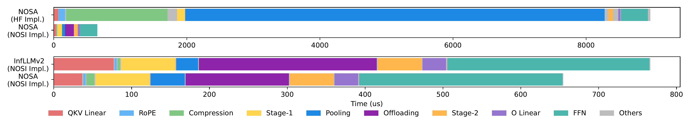

## 主线二子章节 2：稀疏 Attention 与稀疏 KV 访问

父章节：`6. 主线二：KV 不再只是容量对象，而是生命周期对象`

### 0. 判断-证据对齐表

| 判断 | 直接支撑材料 | 关键数字或图 |
| --- | --- | --- |
| 稀疏 attention 的系统价值在于减少 selected KV transfer，而不只是少算 attention | `S006 (NOSA)` | decode 吞吐最高 `2.3x`；selected KV transfer 仍可能主导成本 |
| CPU 从"整块搬运者"变成逐块选择、预取和恢复的 policy engine，metadata 管理开销上升 | `S006 (NOSA) S007 (ScoutAttention)` | ScoutAttention 约 `2.1x` speedup；layer-ahead CPU pre-computation |
| reduced-KV / hybrid attention 进一步降低容量压力，但放大 placement 决策的价值密度 | `S013 (Kimi Linear)` | KV cache usage 最多降低 `75%`；`1M` context 下 decode 吞吐最多提升 `6x` |
| 稀疏访问的收益不会自动兑现，CPU 的 block selection policy 质量是决定性变量 | `S006 (NOSA) S007 (ScoutAttention)` | 错取/漏取会吃掉理论收益；transfer domination 仍可能主导 |

### 1. 本章核心判断

稀疏 attention 在服务化推理中的价值，不只是"少算一些注意力"，而是把 CPU 的工作从**大块搬运**推进到**逐块决策**。NOSA 的关键判断非常直接：决定收益的，不是理论上保留了多少 token，而是 selected KV transfer 是否仍然主导成本；其公开结果是 decode throughput 最高可提升 `2.3x`。[1] 这说明 sparse KV access 不会让 CPU 退出关键路径，反而会让 CPU 更像一个**状态 policy engine**——它需要为每一层、每一个 block 做选择：哪些值得保留、哪些值得提前拉回、哪些根本不值得恢复。

### 2. 为什么 sparse access 和普通 offload 不是一回事

如果只有普通 offload，问题更像"KV 太大，搬出去，需要时再搬回来"。但一旦 access 模式变稀疏，问题马上变成：

- 哪些块值得保留在近端；
- 哪些块值得提前拉回；
- 哪些块根本不值得恢复；
- 错取和漏取会不会抵消理论收益。

也就是说，系统已经从容量治理转向**访问治理**。`S006 (NOSA)` 的重要性就在这里：它不是抽象讨论 sparse attention，而是把 sparse pattern 与 offload path 一起设计，把论文目标直接锚定在服务系统里的 KV 迁移成本上。[1]

从 CPU 角度看，这个转变意味着工作性质的质变：

| 维度 | 普通 offload | 稀疏 access |
| --- | --- | --- |
| CPU 决策粒度 | 整块 / 整层 | block / token range |
| CPU 核心动作 | 发起 DMA 搬运 | 选择、筛选、编排 |
| metadata 开销 | 低（只需记录块地址） | 高（需记录每块的稀疏掩码、命中历史、复用概率） |
| 错取代价 | 低（大不了全搬回来） | 高（错取的块直接浪费带宽和延迟） |

### 图 1：NOSA 系统框架展示了 CPU 控制面与 GPU 执行面的新边界

图 1 说明 NOSA 不是简单地在 GPU 内做稀疏计算，而是把 block selection、locality decision 和跨层状态管理明确交给 CPU 控制面。它支撑本节的核心判断：稀疏 attention 的系统价值来自 CPU 的 policy 质量，而不是 GPU 少算了多少 FLOPs。[1]

### 3. CPU 为什么必须变成逐块 policy engine

NOSA 之所以关键，不只是因为它用了 sparse attention，而是因为它从一开始就把 sparse attention 设计成 `offload-friendly`。这意味着研究目标已经变成：

- 不是只追求理论上的注意力稀疏；
- 而是追求能减少 CPU-GPU KV transfer 的稀疏。

这很重要，因为它第一次把 sparse attention 的价值直接锚定到 serving 系统成本上。若 selected KV transfer 仍然很大，GPU 少算出来的那些 FLOPs 可能完全不够抵消层级间搬运与恢复的额外延迟。[1]

从 CPU 的 workload 角度看，"逐块 policy engine"意味着三项具体新增开销：

**Block selection 计算。** CPU 需要在每个 layer 的注意力计算之前，根据稀疏掩码或启发式规则决定哪些 KV block 应该被保留或恢复。这个决策的输入可能包括：当前 query 的 token 特征、历史访问模式、block 的复用概率、以及层级间带宽预算。决策本身虽然计算量不大，但频率极高（每 layer 每请求一次），且必须在 GPU 需要数据之前完成。

**Metadata 维护。** 稀疏访问需要 CPU 维护比全量访问更丰富的 metadata：每个 block 的稀疏掩码、命中计数、最后访问时间、复用概率估计。这些 metadata 的内存 footprint 虽然远小于 KV 本身，但访问频率很高，且需要保证与 GPU 执行同步的一致性。

**错取/漏取的恢复代价。** 一旦 CPU 的 block selection 出现误判，要么把不需要的块拉回来（错取，浪费带宽），要么把需要的块漏掉（漏取，导致 GPU 等待或重新计算）。NOSA 的实验表明，selected KV transfer 仍可能主导整体成本，这意味着 policy 质量的边际改善会直接转化为系统级收益。[1]

### 图 2：性能分解揭示了 selected KV transfer 为何仍可能主导成本

图 2 的价值在于把"稀疏访问收益"拆解成可观测的组成部分。它支撑本节的关键判断：即使 attention 计算被大幅削减，如果 CPU 的 transfer 决策不够精准，带宽和延迟仍可能吃掉大部分理论收益。[1]

### 4. ScoutAttention 如何强化 CPU 的前移角色

ScoutAttention 对这个转变给出了更强的工程化证据。它不是只说"稀疏访问很好"，而是让 CPU 在 layer-ahead 阶段参与预计算，以便更早知道后续层需要哪些 KV，并提前准备恢复路径。公开结果是约 `2.1x` speedup，精度损失控制在 `<2.4%`。[2] 这说明 CPU 的价值不再只是开 DMA，而是在**预测、筛选和编排**将被访问的状态。

从 control-plane 角度看，这意味着 CPU 需要持续回答：

1. 哪些 KV 值得被选入下一层的热路径；
2. 哪些 KV 应保持在更近层级；
3. 哪些恢复动作应提前隐藏在前一层计算期间；
4. 哪些稀疏访问只是噪声，不值得为其预热。

### 5. reduced-KV 为什么进一步放大了 placement 价值

`S013 (Kimi Linear)` 的 Kimi Linear 说明 reduced-KV / hybrid attention 会进一步改变成本结构：论文给出 KV cache usage 最多降低 `75%`，在 `1M` context 下 decode throughput 最多可提升 `6x`。[3] 这类结果看起来像"容量问题被缓解了"，但它真正带来的系统后果是：当 KV 总量下降后，**剩下那些仍需要保留和搬运的状态就更值得被精细放置**。容量压力下降，并不意味着 CPU 变轻；更准确地说，是 CPU 的工作从"是否能放下"转向"如何把少量但更高价值的状态放在更对的位置"。

### 6. 边界：稀疏访问的收益为什么不会自动兑现

这一方向仍有一个必须保留的审慎判断：公开资料已经能证明收益方向，但代价函数还不完整。公开材料对 sparse KV policy 的 hit quality、metadata overhead 和生产级误判成本，仍缺少足够完整的实测指标。因此，本节更稳妥的结论是：

> 稀疏 attention 已经足以证明 CPU 会从"大块搬运者"变成细粒度状态 policy engine；但不同 policy 的误判代价、metadata 开销和线上命中质量，仍需要更多实测补齐。

### 7. 追加洞察：收益与代价的完整框架

稀疏 attention 方向的公开材料往往更强调收益侧（`2.3x`、`2.1x`、`75%`、`6x`），但代价侧同样值得被系统化地写入判断。基于已有材料，可以建立一个更完整的"收益-代价"对照框架：

| 维度 | 收益 | 代价 |
| --- | --- | --- |
| 数据传输 | 每步必须搬运的 KV 数据量减少 | CPU 需要维护更细粒度的 block / token 元数据 |
| 计算重叠 | layer-ahead 预计算可与 GPU 并行 | policy 误判时，稀疏访问会带来新的 miss 和恢复抖动 |
| 容量压力 | KV cache usage 最多降低 `75%` | 剩余高价值状态的 placement 决策质量要求更高 |
| 生命周期 | 给 pause-resume、warm-tier、远端 prefill 留出带宽预算 | CPU 必须承担 event-driven retention 和 selective eviction 的策略负载 |

这个框架的关键结论不是"收益大于代价"，而是：**稀疏 attention 的收益越来越依赖 locality engineering，而不只是算子本身。**[1][2][3] 当 CPU 的 block selection policy 做错时，稀疏访问不仅不会减少传输，还可能因为错取和漏取而增加恢复路径的不可预测性。因此对 AI CPU 设计而言，真正值得追踪的不是"稀疏率多少"，而是"policy 决策的延迟、命中质量和 metadata 开销是否可控"。

### 8. 小结

稀疏 attention 和 sparse KV access 并没有让 CPU 离开关键路径，而是把 CPU 推向更细粒度的控制面。NOSA 的 `2.3x` 吞吐提升、ScoutAttention 的 `2.1x` 预取收益，以及 Kimi Linear 对 reduced-KV 的证明，共同支撑一个稳定判断：**当访问从"全量取回"转向"有选择地取回"时，CPU 的核心价值就从搬运带宽转向状态判断质量。** 这个转变不是免费的：CPU 需要承担 block selection、metadata 维护和错取/漏取风险三项新增负载。[1][2][3]

### 参考文献

[1] [NOSA: Native and Offloadable Sparse Attention](../../../material/reference-notes/s006-nosa-native-and-offloadable-sparse-attention.md). 2025-10-15.

[2] [ScoutAttention: Efficient KV Cache Offloading via Layer-Ahead CPU Pre-computation](../../../material/reference-notes/s007-scoutattention-efficient-kv-cache-offloading-via-layer-ahead-cpu-pre-computation.md). 2026-03-28.

[3] [Kimi Linear: An Expressive, Efficient Attention Architecture](../../../material/reference-notes/s013-kimi-linear-an-expressive-efficient-attention-architecture.md). 2025-10-30.
