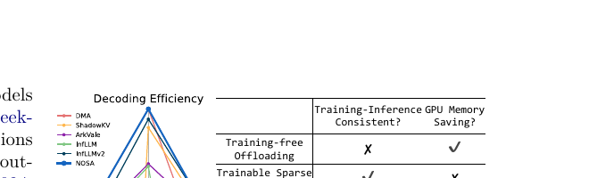

## 主线二子章节 2：稀疏 Attention 与稀疏 KV 访问

父章节：`6. 主线二：KV 不再只是容量对象，而是生命周期对象`

### 0. 判断-证据对齐表

| 判断 | 直接支撑材料 | 关键数字或图 |
| --- | --- | --- |
| 稀疏 attention 的系统价值在于减少 selected KV transfer，而不只是少算 attention | `S006 (NOSA)` | 解码吞吐最高 `2.3x`；memory hierarchy / sparse framework 图 |
| CPU 会从“整块搬运者”变成细粒度选择、预取和恢复的 policy engine | `S006 (NOSA) S007 (ScoutAttention)` | ScoutAttention layer-ahead CPU pre-computation；约 `2.1x` speedup |
| 稀疏访问越强，越需要精确的 locality 决策，否则收益会被错取和漏取吃回去 | `S006 (NOSA) S007 (ScoutAttention) S013 (Kimi Linear)` | transfer domination；reduced-KV / hybrid attention 降低容量但放大 placement 价值 |

### 1. 本章核心判断

稀疏 attention 在服务化推理中的价值，不只是“少算一些注意力”，而是把 CPU 的工作从大块搬运推进到**更细粒度的选择、保留、预取和恢复**。NOSA 的关键判断非常直接：决定收益的，不是理论上保留了多少 token，而是 selected KV transfer 是否仍然主导成本；其公开结果是 decode throughput 最高可提升 `2.3x`。[1] 这说明 sparse KV access 不会让 CPU 退出关键路径，反而会让 CPU 更像一个状态 policy engine。

### 2. 为什么 sparse access 和普通 offload 不是一回事

如果只有普通 offload，问题更像“KV 太大，搬出去，需要时再搬回来”。但一旦 access 模式变稀疏，问题马上变成：

- 哪些块值得保留在近端；
- 哪些块值得提前拉回；
- 哪些块根本不值得恢复；
- 错取和漏取会不会抵消理论收益。

也就是说，系统已经从容量治理转向访问治理。`S006 (NOSA)` 的重要性就在这里：它不是抽象讨论 sparse attention，而是把 sparse pattern 与 offload path 一起设计，把论文目标直接锚定在服务系统里的 KV 迁移成本上。[1]

### 图 1：稀疏 KV 访问的核心不是省容量，而是重写层级访问路径

图 1 说明稀疏 attention 真正改变的是 memory hierarchy 上哪些 KV 会被触达。它支撑本节的核心判断：系统需要的不是“大搬运”，而是更细的 locality 决策。[1]

### 3. NOSA 代表了什么

NOSA 之所以关键，不只是因为它用了 sparse attention，而是因为它从一开始就把 sparse attention 设计成 `offload-friendly`。这意味着研究目标已经变成：

- 不是只追求理论上的注意力稀疏；
- 而是追求能减少 CPU-GPU KV transfer 的稀疏。

这很重要，因为它第一次把 sparse attention 的价值直接锚定到 serving 系统成本上。若 selected KV transfer 仍然很大，GPU 少算出来的那些 FLOPs 可能完全不够抵消层级间搬运与恢复的额外延迟。[1]

### 4. 为什么 CPU 会前移成 `policy engine`

ScoutAttention 对这个转变给出了更强的工程化证据。它不是只说“稀疏访问很好”，而是让 CPU 在 layer-ahead 阶段参与预计算，以便更早知道后续层需要哪些 KV，并提前准备恢复路径。公开结果是约 `2.1x` speedup，精度损失控制在 `<2.4%`。[2] 这说明 CPU 的价值不再只是开 DMA，而是在**预测、筛选和编排**将被访问的状态。

从 control-plane 角度看，这意味着 CPU 需要持续回答：

1. 哪些 KV 值得被选入下一层的热路径；
2. 哪些 KV 应保持在更近层级；
3. 哪些恢复动作应提前隐藏在前一层计算期间；
4. 哪些稀疏访问只是噪声，不值得为其预热。

### 图 2：layer-ahead 预计算把 CPU 从搬运者前移成协同计算者

图 2 的价值在于说明稀疏访问收益并非自动发生，而是需要 CPU 提前参与下一层的访问准备。也因此，预取与恢复开始像调度动作，而不只是内存动作。[2]

### 5. reduced-KV 为什么进一步放大了 placement 价值

`S013 (Kimi Linear)` 的 Kimi Linear 说明 reduced-KV / hybrid attention 会进一步改变成本结构：论文给出 KV cache usage 最多降低 `75%`，在 `1M` context 下 decode throughput 最多可提升 `6x`。[3] 这类结果看起来像“容量问题被缓解了”，但它真正带来的系统后果是：当 KV 总量下降后，**剩下那些仍需要保留和搬运的状态就更值得被精细放置**。容量压力下降，并不意味着 CPU 变轻；更准确地说，是 CPU 的工作从“是否能放下”转向“如何把少量但更高价值的状态放在更对的位置”。

### 6. 边界：稀疏访问的收益为什么不会自动兑现

这一方向仍有一个必须保留的审慎判断：公开资料已经能证明收益方向，但代价函数还不完整。公开材料对 sparse KV policy 的 hit quality、metadata overhead 和生产级误判成本，仍缺少足够完整的实测指标。因此，本节更稳妥的结论是：

> 稀疏 attention 已经足以证明 CPU 会从“大块搬运者”变成细粒度状态 policy engine；但不同 policy 的误判代价、metadata 开销和线上命中质量，仍需要更多实测补齐。

### 7. 小结

稀疏 attention 和 sparse KV access 并没有让 CPU 离开关键路径，而是把 CPU 推向更细粒度的控制面。NOSA 的 `2.3x` 吞吐提升、ScoutAttention 的 `2.1x` 预取收益，以及 Kimi Linear 对 reduced-KV 的证明，共同支撑一个稳定判断：**当访问从“全量取回”转向“有选择地取回”时，CPU 的核心价值就从搬运带宽转向状态判断质量。**[1][2][3]

### 参考文献

[1] NOSA: Native and Offloadable Sparse Attention. 2025-10-15.

[2] ScoutAttention: Efficient KV Cache Offloading via Layer-Ahead CPU Pre-computation. 2026-03-28.

[3] Kimi Linear: An Expressive, Efficient Attention Architecture. 2025-10-30.
