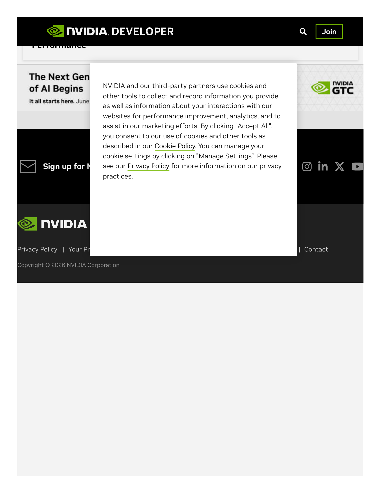
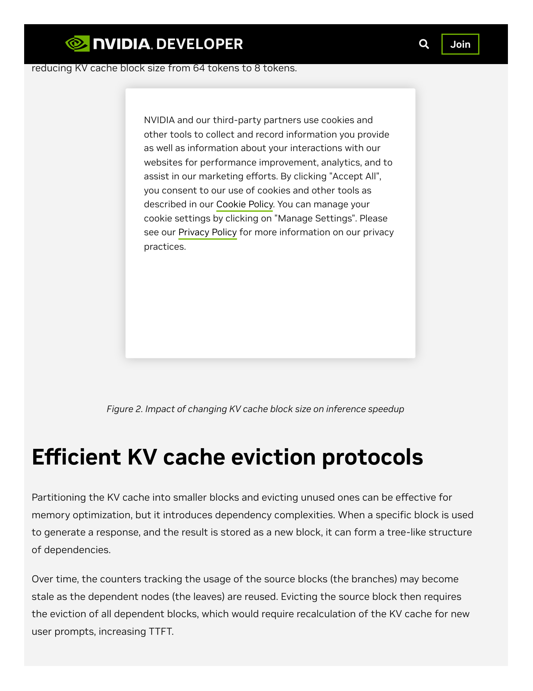

## 主线二子章节 3：Prefix Cache 是第一代状态复用技术

父章节：`6. 主线二：KV 不再只是容量对象，而是生命周期对象`

### 0. 判断-证据对齐表

| 判断 | 直接支撑材料 | 关键数字或图 |
| --- | --- | --- |
| APC 应被理解为第一代状态复用控制平面，其核心价值是避免重复 prefill | `S010 (vLLM APC) S043 (TensorRT-LLM early reuse)` | TTFT 最多提升 `5x` |
| APC 的 CPU 开销集中在 block-level hash 计算、匹配查找和 LRU eviction，高并发下不可忽视 | `S010 (vLLM APC)` | block size 默认 `64` tokens；vLLM Prefix Cache Manager 架构 |
| 缩小 block size 可改善命中精度，但直接增加 CPU 的 metadata 管理密度 | `S043 (TensorRT-LLM early reuse)` | block size `64 -> 8` tokens 最多再增 `7%` TTFT 改善 |
| APC 的边界在于它主要处理 exact shared prefix，本身不解决分布式路由和长期保留 | `S010 (vLLM APC) S043 (TensorRT-LLM early reuse)` | KV cache manager / LRU eviction；early reuse 仍需更细粒度机制 |

### 1. 本章核心判断

`Automatic Prefix Caching` 的历史地位需要被重新定义。它不应被理解成一个局部的小优化，而应被理解成第一代**状态复用控制平面**技术。原因很直接：它第一次把"跨请求共享已有 KV"从经验性技巧变成了 runtime 内建能力。vLLM 的 APC 设计文档已经把 prefix cache manager、full-block matching 和 eviction 机制作为系统组成部分，而 TensorRT-LLM 的 early reuse 结果则表明，这种系统化状态复用可以把 TTFT 压低到最多 `5x`，并且把 block size 从 `64` tokens 缩到 `8` tokens 还能再带来最多 `7%` 的改善。[1][2]

但本章要补充的视角是：**APC 对 CPU 的影响不只是"多了一项优化功能"，而是引入了一套持续的运行时开销**——hash 计算、block table 查找、LRU eviction 决策——这些开销在单机高并发下可能不显眼，但随着请求频率和 block 粒度同时上升，会成为 CPU 调度路径上的真实负载。

### 2. 为什么 APC 是状态复用控制平面的起点

APC 真正完成了三件此前并不显式的事：

1. 它把"前缀是否相同"的判断从应用层移到推理系统层。
2. 它把"命中缓存"的收益直接转化成 TTFT、prefill token 数和 GPU 时间的减少。
3. 它强迫系统维护一套最基本的状态身份机制，即某段 KV 对应哪段输入、在哪个 block 边界上可复用、何时仍然有效。

因此，APC 的意义远不止"命中了就省 token"。它意味着服务系统开始默认：**状态复用本身值得被系统化对待。**[1][2]

### 3. APC 机制对 CPU 的具体运行时开销

从 CPU 角度看，APC 引入了三项新增工作：

**Hash 计算。** 每个 incoming request 的 prefix 都需要被 hash，以便在 block table 中查找是否已有匹配。vLLM 使用的是基于 token 内容的 block hash，计算本身不复杂，但频率与请求数成正比。在 batch size 较大或请求到达率较高的场景中，hash 计算会占用 CPU 的一个稳定核心周期比例。

**Block matching 查找。** 找到 hash 匹配后，CPU 还需要验证 block 内容是否确实一致（防止 hash 碰撞），并在 block table 中标记命中。这个查找动作的延迟虽然很短，但需要在调度临界路径上完成，因为它直接影响当前请求该被分配多少 prefill 工作。

**LRU eviction 决策。** 当显存不足时，CPU 需要决定哪些 block 应该被驱逐。vLLM 的默认策略是 LRU，但如 `S045 (Persistent/Pinned Prefixes)` 后续所示，简单 LRU 已不足以表达高价值前缀的保留需求。这说明 eviction 决策本身正在从简单的时钟算法，升级为需要考虑业务价值的策略问题——CPU 的决策复杂度在上升。

这三项开销的叠加效应可以用一个定性框架理解：

| 因素 | 对 CPU 开销的影响 |
| --- | --- |
| 请求并发度 ↑ | hash + matching 频率线性增加 |
| Block 粒度 ↓（64→8） | metadata 密度增加 8x，table 查找和 eviction 更频繁 |
| Shared prefix 比例 ↑ | matching 命中率上升，但每次 hit 仍需 CPU 验证和引用计数更新 |
| Session 生命周期 ↑ | block table 常驻内存增大，LRU 队列变长，eviction 决策成本微增 |

### 图 1：TensorRT-LLM Early Reuse 的 TTFT 改善验证了 APC 的系统级价值

图 1 不是 APC 的实现图，而是工业级验证：当状态复用被系统化实施后，首 token 延迟可以被大幅压低。它支撑本节的核心判断：APC 的价值不是"平均省下一点算力"，而是把状态复用正式引入了服务系统的关键路径。[2]

### 4. Block size 调优背后的 CPU 代价

`S043 (TensorRT-LLM early reuse)` 的一个关键发现是：把 block size 从 `64` tokens 缩小到 `8` tokens，可以在 `5x` TTFT 改善的基础上再带来最多 `7%` 的提升。[2] 这个发现的另一面是：**CPU 的 metadata 管理密度增加了 8 倍。**

更细的 block 粒度意味着：
- 同样长度的 prefix 需要管理 8 倍的 block 数量；
- Block table 的内存 footprint 增加；
- Hash 计算和 matching 的频率增加（因为每个 block 边界都是一次匹配机会）；
- Eviction 决策的粒度变细，策略空间变大。

`7%` 的 TTFT 改善是系统级净收益，但它没有披露 CPU 侧付出了多少额外开销。这是一个值得注意的盲区：当工业界不断追求更细的粒度以获得更高命中率时，CPU 控制面的 metadata 管理成本可能被低估。

### 图 2：Block size 调优对 TTFT 的边际改善与 CPU metadata 密度的权衡

图 2 支撑的判断是：更细的 block 粒度确实能改善命中精度，但它直接增加 CPU 的 block table 管理密度。这个权衡在 APC 的第一代实现中已被埋下伏笔。[2]

### 5. APC 没有解决什么

之所以说 APC 只是第一代，是因为它解决的问题仍然有限：

- 它主要回答"同样的前缀能不能重用"，没有回答"不同但相似的状态能不能部分重用"；
- 它更像单机或单 worker 内部的 reuse primitive，没有真正处理分布式 worker 之间的状态可见性；
- 它把问题更多表述为"有没有命中"，而不是"命中是否稳定、是否值得为此牺牲负载均衡"；
- 它对多模态 identity、branching execution 和长期 pinned prefix 的表达能力有限。[1][2]

也正因此，第一代 APC 一落入真实服务环境，很快就会催生后续问题：请求该被路由到哪台更可能命中的 worker，哪些 prefix 值得长期保留，以及命中与均衡冲突时应该优先谁。

### 6. 为什么说它是"第一代"而不是"完整方案"

把 APC 定位成第一代，有两个好处。第一，它承认这项技术已经完成了状态复用的基础抽象：状态可被识别、保留、再利用。第二，它也清楚承认这一步仍然过于朴素，后面还必须引入 routing、retention、events 和更强的 identity 机制。换句话说，APC 为后续控制面铺了路，但它本身并不是终点。它先证明了"已有状态值得被看见和重用"，后续章节要讨论的则是：这些状态该如何跨 worker 被路由、如何被长期保留、以及在分支和多模态场景下该如何被正确标识。

### 7. 追加洞察：第一代 APC 已经暴露出的四类工程代价

APC 作为第一代技术，不仅边界清晰，而且真实部署中已经开始暴露代价。这些代价虽然在本节没有展开，但它们是理解"为什么必须进入第二阶段演化"的关键因果线索：

**Dirty cache impact。** 工程反馈已经指出，prefix cache 的收益不仅取决于"有没有共享前缀"，还取决于 block 释放次序、free-list 行为和脏缓存残留对后续命中的影响。这说明 CPU 侧不仅要维护 cache view，还要维护 **cache hygiene**——一个被第一代设计 largely ignored 的职责。[1]

**Persistent / pinned prefix 需求。** 社区持续提出"高价值前缀应常驻"的需求，反过来证明单纯 LRU eviction 已不足以表达业务价值。一旦系统开始支持 pinned prefixes，CPU 就必须承担更强的优先级和驻留预算管理。[1]

**Performance instability。** 真实反馈表明，prefix cache 下 first-token latency 可能在 `50ms` 到 `500ms+` 之间显著波动。这意味着命中本身不是最终目标，**稳定命中与稳定恢复**才是服务化推理真正关心的指标。CPU 侧的 prefix matching、cache lookup 和 block reconstruction 路径在不同请求特征下产生高度可变开销。[1]

**Multimodal cache identity。** 在多模态场景中，仅用文本前缀做 cache identity 可能导致错误复用。这对 agentic workload 尤其重要，因为 GUI / mobile agent 的视觉输入会频繁变化，但文本指令骨架往往相似。CPU 的 hash 计算逻辑因此需要纳入更多模态特征，identity 复杂度上升。[1]

这四类代价共同指向一个更深层的问题：

> `prefix cache` 的瓶颈已经开始从"如何命中"转向"如何让命中的收益稳定、正确、可持续"。这一步天然是 CPU / control plane 问题，而不是单一 kernel 问题。

### 8. 小结

本节想建立的是一个历史定位：APC 之所以重要，不是因为它本身足够复杂，而是因为它第一次把 `state reuse` 明确建成了 runtime 能力。vLLM 的 prefix cache manager 与 TensorRT-LLM 的 `5x` TTFT 改善共同说明，第一代 prefix reuse 已经足以改变服务系统的成本中心；同时，它的 block 粒度、exact prefix 假设和分布式可见性边界，也决定了后续必须出现更强的路由、保留和事件化机制。从 CPU 角度看，APC 引入的 hash 计算、block matching 和 LRU eviction 是第一代控制面开销的雏形；当 block size 从 `64` 缩到 `8` 时，这些开销的密度已被放大 8 倍。下一节讨论的 `routing / retention / events / identity`，正是 APC 这些边界被真实工作负载逼出来的第二阶段演化。[1][2]

### 参考文献

[1] [vLLM Automatic Prefix Caching](../../../material/reference-notes/s010-vllm-automatic-prefix-caching.md). current.

[2] [5x Faster Time to First Token with NVIDIA TensorRT-LLM KV Cache Early Reuse](../../../material/reference-notes/s043-5x-faster-time-to-first-token-with-nvidia-tensorrt-llm-kv-cache-early-reuse.md). 2024-11-08.
