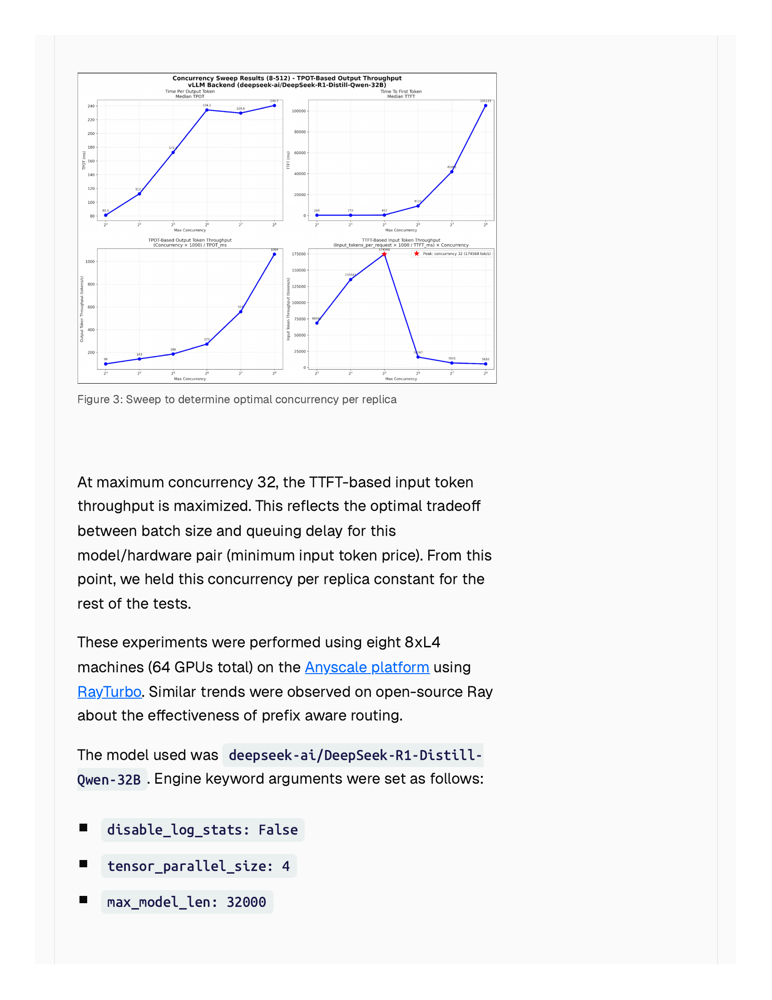

## 主线二子章节 4：Prefix Cache 之后的技术演化

父章节：`6. 主线二：KV 不再只是容量对象，而是生命周期对象`

### 0. 判断-证据对齐表

| 判断 | 直接支撑材料 | 关键数字或图 |
| --- | --- | --- |
| APC 之后的关键演化是 routing、retention、events 与更强 identity，共同把状态复用从单机机制扩展为分布式控制面 | `S011 (BentoML) S016 (Ray) S041 (Anyscale) S042 (vLLM events) S034 (TensorRT-LLM policy)` | `match_rate_threshold = 0.1`；affinity routing；KV event API |
| 分布式 prefix reuse 的第一难题不是命中本身，而是命中与负载均衡的权衡，CPU 路由节点成为新瓶颈 | `S011 S016 S041` | affinity 失衡时回退 P2C；distributed prefix tree 的 CPU 维护成本 |
| 真实工程问题已暴露出 dirty cache、pinned prefixes、性能抖动和多模态 identity 缺陷 | `S044 S045 S046 S047` | `50ms -> 500ms+` 延迟波动；约 `40%` 多模态错误命中率 |
| 这些演化把 CPU 负载从"管理本地 block"扩展到"协调全局状态"，扩展性成为新约束 | `S011 S016 S034 S042` | event 流吞吐；prefix tree 查询复杂度；policy 执行频率 |

### 1. 本章核心判断

`07` 已经把 `Automatic Prefix Caching` 定位为第一代状态复用控制平面。本节要讨论的是它之后被真实部署环境逼出来的第二阶段能力：`prefix-aware routing`、`selective retention`、`event-driven KV reuse` 与 `multimodal / branch-aware cache identity`。这些能力共同把"命中缓存"推进成"编排状态对象"，同时也把 CPU 的负载从**单机 block 管理**扩展到**分布式状态协调**。[1][2][3][4]

### 2. 第一步演化：从 cache hit 走向 cache-aware routing

一旦 prefix cache 进入多 worker / 多 executor 部署，系统不再只关心"有没有相同前缀"，而开始关心"请求应该被送到哪里才能命中已有状态"。Ray Serve 的 PrefixCacheAffinityRouter 直接把这个问题写进 routing policy：当 prefix 匹配率超过默认的 `match_rate_threshold = 0.1` 时优先走 affinity；若负载失衡过重，再回退到 P2C 一类更均衡的策略。[3]

这组规则对 CPU 的影响是双重的：

**Routing 决策的计算负载。** CPU 路由节点需要在每个请求到达时，实时计算其与各 worker 上已有 prefix 的匹配率。这涉及 distributed prefix tree 的查询、匹配率估算、以及阈值比较。`0.1` 的默认阈值说明系统愿意为了 `10%` 以上的匹配概率而承担路由偏置的风险，但这也意味着 CPU 需要维护一棵能够支持快速查询的 prefix tree。

**Affinity 与 balance 的动态权衡。** 如果 affinity routing 导致某些 worker 过热，CPU 需要检测到失衡并触发回退（P2C）。这个权衡不是一次性决策，而是需要持续监控和调整的 control-loop。随着 worker 数增加，prefix tree 的查询复杂度和失衡检测的通信开销都会上升。

### 图 1：Ray PrefixCacheAffinityRouter 展示了 CPU 侧 routing 与 affinity 的耦合机制

图 1 支撑一个关键转折：当共享前缀和高复用变成常态，worker 选择本身就开始受状态位置驱动，而不再只是均衡驱动。CPU 路由节点因此成为状态复用链路上的新瓶颈。[3]

### 3. 第二步演化：从统一 eviction 走向 selective retention

Prefix reuse 真正落地后，很快会遇到一个更现实的问题：不是所有 prefix 的价值都一样。`S045 (vLLM pinned prefix issue)` 直接提出 persistent / pinned prefixes 的需求，说明简单 LRU 已不足以表达高价值前缀；`S044 (vLLM dirty cache issue)` 则从反面揭示 dirty cache impact，会让命中率收益被 block 生命周期管理吃掉。[5][6]

这一步对 CPU 的影响是：**eviction 决策从简单的时钟算法升级为需要考虑业务价值的策略问题。** 高价值状态是否应被 pin 住、何时转入 warm tier、哪些 dirty block 应更早清理，都会直接改变后续 resume 成本。CPU 控制面需要维护更丰富的 metadata（pin flag、priority level、dirty bit、last-access timestamp），并在每次 eviction 时执行更复杂的策略评估。

### 4. 第三步演化：从静态 cache manager 走向 event-driven reuse

vLLM 的 Kv Events Subscriber 是一个明确信号：KV block state 已被事件化，可被外部控制器订阅。`BlockStored`、`BlockRemoved`、`AllBlocksCleared` 这类事件还会携带 block hash、token ids 和 `cache_salt` 等 metadata。[7] 这说明控制面已经不再满足于"某个 worker 内部自己知道 cache 状态"，而是希望将 KV 可见性提升为可观测、可订阅、可联动的系统接口。

一旦事件化成立，CPU 的角色也就随之升级：

- 监听哪些状态刚变热；
- 决定哪些状态应继续保留；
- 将事件反馈给路由器或 warm-tier 控制器；
- 在状态失效时及时调整 placement。

从扩展性角度看，event-driven 架构引入了一个关键变量：**事件流吞吐。** 随着请求数和状态变化率增加，BlockStored/Removed 事件的频率会线性或超线性增长。CPU 需要订阅、过滤、路由这些事件，并在事件处理路径上做出实时决策。这个负载在大型集群中可能变得不可忽视。

### 图 2：TensorRT-LLM 的 eviction policy 架构展示了 CPU 控制面从被动 LRU 到主动策略的升级

图 2 说明工业 serving 栈已经开始把 eviction 和 retention 策略硬化到 CPU 控制面中。它支撑本节的核心判断：状态保留已从 runtime 内部实现细节，升级为需要显式策略管理的控制面职责。[4]

### 5. 第四步演化：从文本前缀走向 multimodal / branch-aware identity

真实 bug 报告把 APC 的下一层边界暴露得更清楚。`S046 (vLLM unstable prefix cache)` 显示 prefix caching 的 first-token latency 可能从 `50ms` 波动到 `500ms+`；`S047 (vLLM multimodal cache bug)` 则揭示多模态并发下，如果 cache identity 忽略视觉输入，会出现错误复用，且相关命中率仅约 `40%`。[8][9]

这两类现象对 CPU 的影响是：**identity 计算的复杂度和正确性要求都在上升。**

- **性能抖动（50ms → 500ms+）：** 说明 CPU 侧的 prefix matching、cache lookup 和 block reconstruction 路径在不同请求特征下产生高度可变开销。当请求分布不均匀时，某些请求可能触发深层的 prefix tree 遍历或大量的 block 引用计数更新，导致尾部延迟恶化。
- **多模态错误复用（~40% 错误命中率）：** 说明 CPU 负责计算的 cache identity（hash key）如果只包含文本 token 而忽略视觉输入，会导致错误命中。修复这个问题意味着 CPU 的 hash 计算需要纳入更多模态的特征，identity 计算的复杂度、内存占用和碰撞概率都会上升。

### 6. CPU 负载的扩展性分析：从单机到分布式

如果把这些演化放在一起看，CPU 的负载增长不是简单的加法，而是结构性的扩展：

| 演化阶段 | CPU 新增职责 | 扩展性约束 |
| --- | --- | --- |
| APC 第一代（07） | Hash 计算、block matching、LRU eviction | 随请求频率线性增长 |
| Routing（本节） | Prefix tree 查询、匹配率计算、affinity/balance 权衡 | 随 worker 数增加，tree 查询和通信开销上升 |
| Retention（本节） | Priority-based eviction、pin 管理、dirty detection | 随 block 数和策略复杂度增长 |
| Events（本节） | Event 订阅、过滤、路由、反馈 | 随状态变化率线性或超线性增长 |
| Identity（本节） | 多模态 hash 计算、碰撞检测、branch-aware identity | 随模态数和分支复杂度增长 |

这个表格揭示了一个关键趋势：**状态复用越深入，CPU 控制面的 coordination 开销就越容易成为新瓶颈。** 当系统从"单机 block 管理"扩展到"分布式状态协调"时，CPU 不再只是管理本地数据结构，而是需要持续维护跨 worker 的状态一致性、路由决策和事件同步。

### 7. 为什么这些演化都会落到 CPU 身上

表面看，这些都是缓存问题；真正承担这些职责的却仍然是 CPU / control plane。

1. 它要维护映射。block、prefix、session、worker、branch 之间的关系必须被记录。
2. 它要做取舍。命中率、均衡性、保留预算、恢复成本之间没有免费的最优解。
3. 它要接事件。一旦状态变化通过事件流暴露出来，就需要外部控制器订阅、解释和反馈。
4. 它要定义身份。多模态、分支、session trunk 的状态边界最终都要通过控制面逻辑判定。

因此，这条演化链的实质不是"缓存越来越高级"，而是状态复用从 runtime 局部优化，演化成 AI CPU 需要持续协调的分布式控制面职责。

### 8. 追加洞察：第二阶段之后，真正重要的不是"更大的缓存"

如果把 prefix cache 的整条演化链拉通来看，一个容易被忽略的转折是：**第二阶段的关键收益不是来自"缓存更大"，而是来自"复用更早 + 状态更可见 + 保留更精准"。**

- **更早的复用时机。** TensorRT-LLM 的 early reuse 已经证明，在 burst system prompt 场景里，early reuse 可带来最高 `5x` TTFT 改善；把 block size 从 `64` 缩到 `8` token 又可带来最多 `7%` 的额外改善。这说明 prefix cache 的收益不仅取决于"有没有相同 prefix"，还取决于"多早能开始复用"。[4]
- **更可见的缓存状态。** vLLM 的 KV Events Subscriber 把 block state 暴露成 `BlockStored` / `BlockRemoved` / `AllBlocksCleared` 事件流，意味着 cache state 从"本地内存表"走向"可被外部控制器订阅的系统事件"。控制面能看到的 state 越及时、越完整，routing 和 retention 的决策质量就越高。[7]
- **更精准的保留策略。** TensorRT-LLM 的 priority-based eviction 和 selective retention 说明，工业 serving 栈已经开始把"哪些状态值得留下"作为显式策略问题处理，而不是交给统一 LRU。[4]

但这三个方向也同时引入了一个隐性风险：**metadata overhead 可能开始反吃收益。** 当 CPU 需要维护 distributed prefix tree、event subscription、priority eviction metadata 和 multimodal identity 时，这些控制面结构的内存占用、计算延迟和同步开销会随集群规模非线性增长。一旦 metadata 管理的代价超过复用节省的 prefill 算力，状态复用就会从"净收益"变成"净负债"。

因此，对 AI CPU 设计而言，这条演化链最值得持续追踪的不是"功能有没有"，而是以下四个问题：

1. **Router 是否真的看到了 cache state？** 还是只维护了过时的近似视图？
2. **Retention policy 是否能识别高价值 session trunk？** 还是只能按简单 LRU 或固定规则驱逐？
3. **Event stream 是否足够快、足够便宜？** 事件处理的延迟和吞吐会不会成为新的瓶颈？
4. **Metadata overhead 是否开始反吃掉复用收益？** 当 worker 数、session 数和模态数同时增加时，控制面结构的扩展性是否还能保持正向 ROI？

这四个问题会直接决定 prefix cache 技术链最终是在 agentic serving 里成为核心控制平面，还是停留在局部优化。[1][2][3][4][5][6][7][8][9]

### 9. 小结

Prefix cache 之后的技术演化，本质上是在回答 APC 没有回答完的问题：命中应如何跨 worker 被利用，哪些 prefix 值得长期保留，状态变化如何对外可见，以及多模态和分支负载下状态身份该如何定义。`0.1` 的 routing 阈值、`50ms -> 500ms+` 的抖动症状、persistent/pinned prefix 需求和多模态错误复用 bug，共同支撑一个稳健判断：**状态复用已经从本地命中机制，演化成 AI CPU 需要持续协调的分布式控制面。** 从 CPU 负载角度看，这个演化引入了五项新增职责（routing、retention、events、identity、扩展性协调），每项都有自己的计算、内存和通信开销。下一节再往前一步，讨论这些能力如何被工业 serving stack 做成显式控制面对象。[1][2][3][4][5][6][7][8][9]

### 参考文献

[1] [Prefix-aware routing](../../../material/reference-notes/s011-prefix-aware-routing.md). current.

[2] [Ray PrefixCacheAffinityRouter](../../../material/reference-notes/s016-ray-prefixcacheaffinityrouter.md). 2026/current.

[3] [Prefix-aware routing — Ray Serve LLM](../../../material/reference-notes/s041-prefix-aware-routing-ray-serve-llm.md). current.

[4] [Introducing New KV Cache Reuse Optimizations in NVIDIA TensorRT-LLM](../../../material/reference-notes/s034-introducing-new-kv-cache-reuse-optimizations-in-nvidia-tensorrt-llm.md). 2025.

[5] [[Performance]: Improve Prefix Cache Hit Rate and Reduce Dirty Cache Impact](../../../material/reference-notes/s044-performance-improve-prefix-cache-hit-rate-and-reduce-dirty-cache-impact.md). 2025-09-07.

[6] [[Feature]: Support Persistent/Pinned Prefixes in Prefix Caching](../../../material/reference-notes/s045-feature-support-persistent-pinned-prefixes-in-prefix-caching.md). 2025-08-18.

[7] [Kv Events Subscriber — vLLM](../../../material/reference-notes/s042-kv-events-subscriber-vllm.md). current.

[8] [[Bug]: The performance for Prefix Caching is very unstable for different requests](../../../material/reference-notes/s046-bug-the-performance-for-prefix-caching-is-very-unstable-for-different-requests.md). 2024-05-09.

[9] [[Bug]: Prefix caching ignores visual input, causing incorrect multimodal outputs under concurrency](../../../material/reference-notes/s047-bug-prefix-caching-ignores-visual-input-causing-incorrect-multimodal-outputs-und.md). 2025-06-23.
