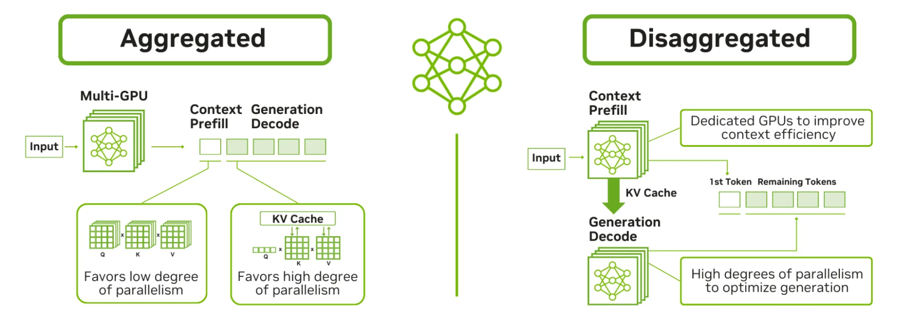

## 主线二子章节 5：KV 的工业控制平面化趋势

父章节：`6. 主线二：KV 不再只是容量对象，而是生命周期对象`

### 0. 判断-证据对齐表

| 判断 | 直接支撑材料 | 关键数字或图 |
| --- | --- | --- |
| 工业界已经把 KV 当成可观测、可调度、可迁移的一等系统对象 | `S003 (NVIDIA Dynamo agentic) S014 (NVIDIA Dynamo NIXL) S034 (TensorRT-LLM KV reuse) S042 (vLLM KV Events)`；**S052** (Sutradhara) | KV-aware placement；priority scheduling；KV event API；NIXL unified transfer；semantic KV cache tagging |
| KV control plane 的现实目标是把状态位置、传输和生命周期纳入统一决策 | `S003 (NVIDIA Dynamo agentic) S014 (NVIDIA Dynamo NIXL) S042 (vLLM KV Events)`；**S052** (Sutradhara) | read/write ratio `11.7x`；event subscriber；GPU/CPU/storage unified move；orchestrator-aware cache management |
| agentic workload 是推动控制平面化的直接外因 | `S003 (NVIDIA Dynamo agentic) S034 (TensorRT-LLM KV reuse)`；**S052** (Sutradhara) | 高频复用、token-range retention、priority eviction；工具调用占 FTR `30%`~`85%` |

### 1. 本章核心判断

`08` 已经说明，prefix reuse 一旦进入 routing、retention、events 与 identity，就会自然长成控制面问题。再往前走一步，工业界已经不再把 KV 看成“推理过程中顺便产生的一堆缓存”，而是在逐步把它当作需要保留、调度和观测的**控制面实体**。这个判断并不是从抽象趋势推出来的，而是体现在一整套已经公开的接口与机制上：NVIDIA Dynamo 在 agentic inference 场景中直接强调 KV-aware placement、priority scheduling 和 `11.7x` 的 KV 读写比；TensorRT-LLM 引入 priority-based retention 与 token-range reuse；vLLM 则把 KV block state 暴露成可订阅事件；NIXL / Dynamo 又把 GPU、CPU memory 与 storage 间的数据移动统一到显式 transfer API 中。[1][2][3][4]

### 2. 为什么工业界会先把 KV 控制平面化

原因很直接：相比许多更激进的新算法，KV 问题已经足够现实、足够普遍、也足够痛。

#### 2.1 它直接影响时延和成本

KV 是否命中，直接影响 TTFT、resume latency 和 throughput；KV 放在哪里，又直接影响 GPU 需求、带宽预算和 warm-tier 成本。`S003 (NVIDIA Dynamo agentic)` 给出的 `11.7x` 读写比就是一个强烈信号，表明这类状态一旦放错位置，系统会为同一段 KV 重复支付代价。[1]

#### 2.2 它天然跨越多个层级

KV 会同时落到 GPU HBM、CPU memory、host DRAM、远端层级甚至 storage。没有一个单层优化能独自回答这个问题，必须由更高层的控制逻辑做分层和取舍。NIXL / Dynamo 的统一移动接口，本身就是对这种跨层级现实的工程回应。[2]

#### 2.3 它和 agentic workload 高度耦合

在 agentic inference 里，KV 的价值更长期：session trunk 会反复被读，工具链前缀会被复用，分支上下文会频繁恢复。也正因此，KV 生命周期不再是 runtime 内部的小事，而是面向整个请求编排的控制对象。[1][3]

### 图 1：Dynamo 已把 KV-aware placement 与调度写成公开系统能力

图 1 的关键价值是把“KV control plane”从概念落到现成工业机制上：状态位置、优先级与路由已经被拿到前台统一考虑，而不是交给单一 runtime 黑盒处理。[1]

### 3. KV-aware routing：为什么 routing 开始围着状态走

KV-aware routing 的出现，说明工业界已经承认一个现实：请求不应只被送到“最空闲的 worker”，还应被送到“最有价值状态的 worker”。这一变化会直接抬高 CPU 对 `state-location model` 的要求，因为控制面必须同时知道谁更空、谁更近、以及哪条恢复路径更短。[1]

### 4. warm tier：为什么 CPU memory 已经从 spill layer 升级为服务层

工业材料里最值得重视的变化之一，是 CPU memory 不再被描述成单纯兜底层。无论是 coherent CPU memory、host DRAM、CXL 还是更远的 tier，它们都开始更像 warm tier、staging layer 或 retention layer。只要 CPU memory 从 spill 层升级为服务层，设计目标就会从“容量够不够”转向“持续带宽够不够、NUMA locality 是否可控、pinning / mapping 开销是否可预测”。[2][3]

### 5. 生命周期显式建模：为什么 retention policy 已经进入工业 serving

priority-based eviction、token-range retention、early reuse 和 pinned prefix 需求说明，工业界已经承认不同 KV 的价值不同，回收与保留不该由统一策略粗暴处理。也就是说，生命周期不再只是 runtime 内部的回收细节，而是业务价值、恢复成本和资源预算共同决定的 policy 层问题。[3]

### 6. event API 与 state visibility：为什么可见性本身成为能力

工业界真正前进的一步，不只是让 KV 可被保留，而是让 KV **可被观察**。vLLM 的 Kv Events Subscriber 把 `BlockStored`、`BlockRemoved`、`AllBlocksCleared` 暴露给外部控制器，并附带 hash、token id、`cache_salt` 等 metadata。[4]

**Sutradhara**（S052）则把控制平面化推到了语义层：它通过 **semantic KV cache tagging** 让 orchestrator 为不同上下文段附加语义标签（如 `system_prompt`、`tool_schema`、`user_query`、`tool_output`），engine 据此区分高价值 block（长期复用）与瞬态 block（短期即可驱逐），并结合 request-aware scheduling 优先完成 in-flight 请求。[5] 这意味着 KV 的 eviction 决策不再是 engine 内部的局部策略，而是由 orchestrator 根据业务语义显式指导的**控制面策略**。

这意味着控制器可以基于状态变化调整 routing、retention 和 warm-tier 策略，而不必依赖猜测。没有 state visibility，prefix-aware routing 只能靠近似猜测，selective retention 也只能停留在局部 heuristics；一旦状态可见，系统就能从“命中后被动受益”升级成“命中前主动布局”。Sutradhara 的语义标签更进一步：它让系统从"知道状态在哪"升级到"知道状态值多少"——这是控制平面化从**位置管理**走向**价值管理**的关键一步。[5]

### 图 2：统一 transfer API 说明 KV movement 已经被纳入控制面

图 2 在本节更适合支撑“跨层级协同和统一移动已进入系统设计”这一判断，而不是被当成 NIXL 机制细节图。它说明工业控制平面化不仅是“知道状态在哪”，还包括“如何把状态跨 GPU / CPU / storage 协调移动”。[2]

### 7. 为什么这会把 CPU 固定在关键路径上

一旦 KV 成为控制面对象，CPU 的职责就不再只是辅助 GPU 计算，而是必须持续承担：

- 维护状态目录与可见性；
- 协调路由与状态位置；
- 触发和跟踪 transfer；
- 将生命周期事件反馈给保留与回收策略。

也就是说，KV 工业控制平面化的真正后果是：CPU 从“host”变成“state orchestrator”。这一点已经被 `S003 (NVIDIA Dynamo agentic)`、`S014 (NVIDIA Dynamo NIXL)`、`S034 (TensorRT-LLM KV reuse)`、`S042 (vLLM KV Events)` 和 **S052 (Sutradhara)** 的 orchestrator-aware cache management 共同支撑，而不再只是推断。[1][2][3][4][5]

### 8. 小结

本节要说明的是，KV 的工业控制平面化已经从趋势判断变成了接口、策略和数据路径的现实。KV-aware placement、priority eviction、event API、semantic KV cache tagging 和 unified transfer 共同表明：**工业界已把 KV 当成一等系统资源来治理，而 AI CPU 正是这套治理逻辑的主要承载体。** 下一章再往前一步，讨论另一类状态对象 `MoE experts` 为什么会把 CPU 进一步推向动态编排角色。[1][2][3][4][5]

### 参考文献

[1] [Full-Stack Optimizations for Agentic Inference with NVIDIA Dynamo](../material/reference-notes/s003-full-stack-optimizations-for-agentic-inference-with-nvidia-dynamo.md). 2026-04-17.

[2] [NVIDIA Dynamo blog (NIXL section)](../material/reference-notes/s014-nvidia-dynamo-blog-nixl-section.md). 2025.

[3] [Introducing New KV Cache Reuse Optimizations in NVIDIA TensorRT-LLM](../material/reference-notes/s034-introducing-new-kv-cache-reuse-optimizations-in-nvidia-tensorrt-llm.md). 2025.

[4] [Kv Events Subscriber — vLLM](../material/reference-notes/s042-kv-events-subscriber-vllm.md). current.

[5] [Sutradhara: An Intelligent Orchestrator-Engine Co-design for Tool-based Agentic Inference](../material/reference-notes/s052-sutradhara-orchestrator-engine-codesign.md). 2026-01-19.
