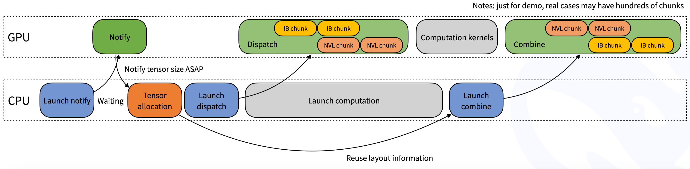
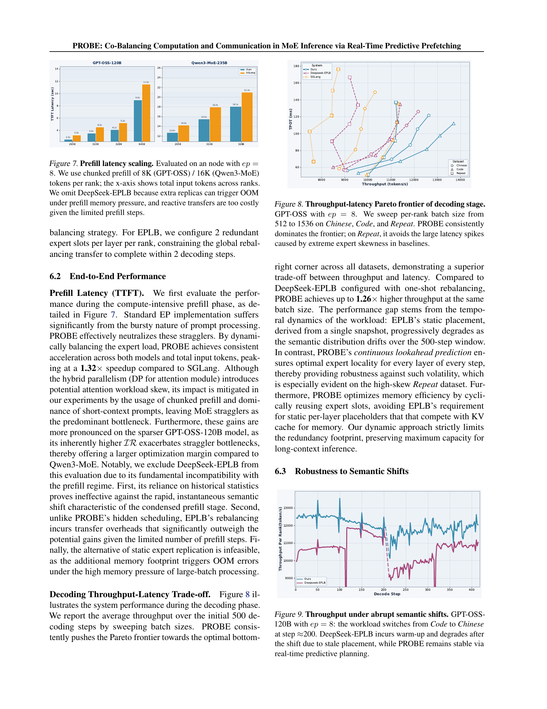
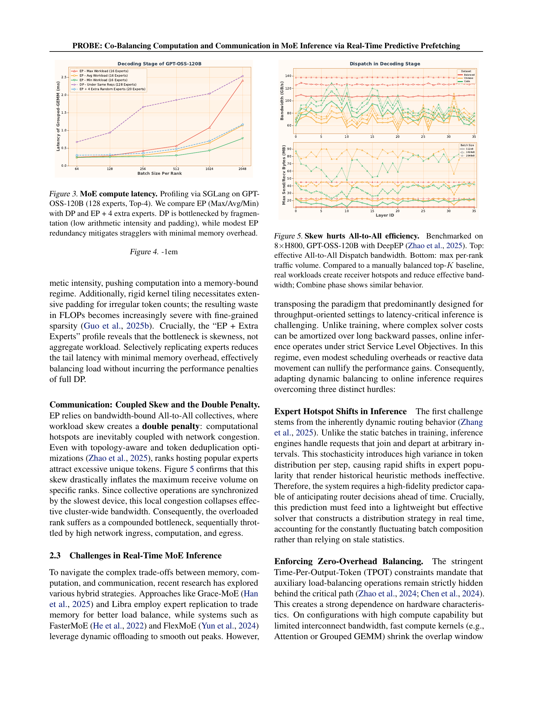

## 主线三子章节 2：MoE 路由动态平衡问题

父章节：`7. 主线三：MoE 为什么会把 host-side orchestration 推到前台`

### 0. 判断-证据对齐表

| 判断 | 直接支撑材料 | 关键数字或图 |
| --- | --- | --- |
| expert skew 比单次 cold miss 更能决定长期吞吐与尾延迟 | `S035 (Wide Expert Parallelism) S036 (FineMoE) S037 (SpecMoEOff) S048 (PROBE)` | wide expert parallelism；expert map；speculative overlap；PROBE 1.32× prefill speedup |
| 动态平衡是跨 token、跨批次、跨时间窗的问题，因此天然回到 CPU / control plane | `S035 (Wide Expert Parallelism) S036 (FineMoE) S048 (PROBE)` | topology-aware placement；history-guided prefetch；real-time predictive scheduling |
| 实际对抗 skew 的方法不是只改 gate，而是改 residency、拓扑和同步窗口 | `S035 (Wide Expert Parallelism) S036 (FineMoE) S037 (SpecMoEOff) S048 (PROBE)` | rack-scale placement；expert map；overlap hiding；dual-track hidden scheduling |

### 1. 本章核心判断

上一章讲的是三条“把收益救回来”的路线，这一章要进一步强调：MoE 在服务化推理里的关键 host-side 问题，不只是“冷 expert 怎么搬”，而是 **如何持续处理 expert skew**。一旦 expert 访问分布不均，系统瓶颈就会迅速从单次权重搬运，升级为 hot/cold expert residency、batch-level balance、topology-aware placement 和 cross-rank synchronization。这说明 MoE routing 已经从局部 gate 选择问题，演化成控制平面问题。[1][2][3]

### 2. 为什么 expert skew 是比冷启动更棘手的问题

冷 expert miss 很容易理解：请求命中不在 GPU 上的 expert，于是 CPU 需要搬权重。但真实 serving 中更难的是 skew。

1. 热门 expert 会反复被打爆。即使大多数 expert 都能卸载，少数高频 expert 仍可能形成持续的驻留争夺。
2. 热门路径会拖垮拓扑。问题不只是哪张 GPU 上放哪个 expert，而是跨 GPU / 跨节点通信图会随热点路径失衡。
3. 批次内部会被热点拉斜。同一微批内 token 路由如果过于集中，会让一部分 worker 拥挤、另一部分空闲。

因此，真正难的问题不是“这次 miss 了哪个 expert”，而是**路由分布会不会长期把系统推向少数热点路径**。[1][2]

### 图 1：本节复用 dispatch 图，强调的是热点分布与拓扑失衡

图 1 支撑的不是某个特定项目机制，而是一个更一般的判断：当分发与聚合已经需要显式考虑拓扑和并行组织时，MoE 的主要难题就不再是局部装载，而是长期平衡。[1]

### 3. 为什么这天然是 CPU / control plane 问题

这类问题之所以会回到 host 侧，有三个原因。

第一，**平衡是跨 token、跨批次、跨时间窗的**。单次 gate 决策可以在模型内部完成，但 hot/cold residency、skew smoothing、历史轨迹复用这类事情，需要跨请求状态和策略记忆，更适合由控制面处理。[2]

第二，**平衡涉及拓扑与放置，而不仅是数学路由**。Wide EP 已经公开承认 MoE 的组织是 rack-scale 问题，意味着“把专家放在哪”与“让哪些 token 去找谁”要被一起考虑。[1]

第三，**平衡的目标本身是多目标的**。系统既要看平均吞吐，也要看尾延迟、链路拥塞和同步窗口。这样的折中天然更像调度问题，而不是纯模型问题。[1][2][3]

### 4. 动态平衡到底在平衡什么

从系统实现上看，MoE 动态平衡至少同时在处理四件事：

- 热专家是否应常驻更近层级；
- 当前微批是否被少数热点拉斜；
- 跨 rank 路由是否会拖慢后续聚合；
- 为了平衡而重排 placement，是否会引入新的迁移代价。

这些目标之间并不存在免费最优解。热专家常驻会抬高内存占用，微批重排会引入额外同步开销，topology-aware placement 可能改善链路压力却增加迁移复杂度。也正因如此，`FineMoE` 才会强调 fine-grained residuals 与历史轨迹，而 `SpecMoEOff` 会强调 overlap hiding。它们都在解决 skew，但切入点不同：一个试图提前感知热点结构，一个试图让热点代价不完整暴露在关键路径上。[2][3]

### 5. PROBE：实时预测调度给出的量化证据

`PROBE` 是 2026-02 公开的 MoE 推理调度工作，它提供了迄今为止最明确的量化证据，说明 expert skew 造成的 straggler 确实可以通过 host-side 预测调度来系统性地消除。[4]

**为什么 PROBE 对本章的问题定义特别重要？**

- 它直接对比了 **DeepSeek-EPLB**（统计静态放置）和 **PROBE**（实时预测）在相同模型（GPT-OSS-120B, ep=8）上的差异。
- 在 prefill 阶段，PROBE 实现了 **`1.32×` speedup over SGLang**；在 decoding 阶段，实现了 **`1.26×` throughput improvement over DeepSeek-EPLB**。
- 更重要的是，论文明确指出了 DeepSeek-EPLB 的 prefill 不兼容性：静态统计在 500-step 语义漂移窗口内退化，额外 replica 在高 batch 下触发 OOM。这说明**静态负载均衡策略在 agentic 场景（长上下文、语义漂移）下存在结构性缺陷**。

**PROBE 揭示的 control-plane 责任**

PROBE 的方法论本身也在强化本章的核心判断：动态平衡不是模型内部问题，而是 CPU / control plane 问题：

1. **Predictor** 是轻量级 MLP，运行在 host 侧，负责预测下一层 expert activation 分布；
2. **Solver** 虽然跑在 GPU 单 SM 上，但由 host 触发，执行 iterative water-filling rebalancing；
3. **Placement update** 由 host 维护 Δ^in/out 集合，决定哪些 expert 需要迁移；
4. **Dual-track pipeline** 的 split-phase transmission 由 host-side orchestration 管理，确保带宽密集型 expert transfer 被隐藏在 compute-heavy windows 中。

这说明，即便预测和求解的计算发生在 GPU 上，**策略触发、状态维护和通信编排仍然牢牢落在 CPU 侧**。

### 图 3：PROBE 的 throughput-latency Pareto frontier 证明实时预测可以系统性地优于静态放置

图 3 在右侧展示了 PROBE 在 GPT-OSS-120B 上的 throughput-latency Pareto frontier：PROBE 在所有数据集上都 dominate 了 DeepSeek-EPLB 和 SGLang。特别是在高 skew 的 Repeat 数据集上，PROBE 避免了 baseline 出现的大幅 latency spike。左下角 Figure 9 则展示了在 step≈200 发生从 Code 到 Chinese 的 abrupt semantic shift 时，DeepSeek-EPLB 因 stale placement 出现吞吐骤降，而 PROBE 凭借 real-time predictive planning 保持稳定。[4]

### 图 4：PROBE 的 MoE compute latency 分解说明 EP+extra experts 仍受 skew 限制

图 4 进一步说明，即便采用 EP+extra experts（增加冗余 replica），如果缺乏实时负载均衡，latency 仍会因 skew 而显著高于理论最优。PROBE 的 co-balancing 策略同时调整 placement 和 routing assignment，才将瓶颈从通信和计算两端同时释放。[4]

### 6. 工业界为什么会先吸收问题域，而不是直接照搬论文方案

图 2 在 `13` 中会被用来支撑“工业界已接受这是组织问题”；在本节中强调的则是另一层含义：一旦组织尺度升到 NVL72 / rack-scale，路由平衡就已经不可能只靠模型内部局部逻辑解决。[1]

### 5. 工业界为什么会先吸收问题域，而不是直接照搬论文方案

从 Wide Expert Parallelism 这样的工业材料来看，工业界已经明确承认：

- expert routing 是批级组织问题；
- placement 是机架级问题；
- 通信图和拓扑必须一起考虑。

但工业界目前吸收的方式仍然比较保守。更常见的是：先把 Wide EP、placement、resident set 组织起来，再逐步吸收更细的 prefetch / skew / speculative overlap 技术。这很合理，因为论文方案往往优化单一维度，而工业系统必须同时满足吞吐、尾延迟、正确性和可运维性。

### 6. 小结

MoE 路由的真正控制面问题，是如何持续消化 expert skew，而不是只处理偶发 cold miss。Wide EP、FineMoE、SpecMoEOff 和 PROBE 共同说明：**只要热点、拓扑和同步链一起作用，动态平衡就天然需要 CPU 维护跨时间窗的状态与策略记忆。** PROBE 的 `1.32×` / `1.26×` 进一步证明，当这种策略记忆升级为实时预测调度时，收益可以从"缓解问题"推进到"系统性地消除 straggler"。下一章再接着讨论：研究界究竟在用哪些 residency / prefetch / overlap 路线来修这条链。[1][2][3][4]

### 参考文献

[1] [Scaling Large MoE Models with Wide Expert Parallelism on NVL72 Rack-Scale Systems](../material/reference-notes/s035-scaling-large-moe-models-with-wide-expert-parallelism-on-nvl72-rack-scale-system.md). 2025-12-18.

[2] [FineMoE: Modeling Fine-Grained MoE Residuals for Expert Prefetching in Serving](../material/reference-notes/s036-finemoe-modeling-fine-grained-moe-residuals-for-expert-prefetching-in-serving.md). 2025-10-04.

[3] [SpecMoEOff: Accelerating Mixture-of-Experts Inference via Speculative Expert Offloading](../material/reference-notes/s037-specmoeoff-accelerating-mixture-of-experts-inference-via-speculative-expert-offl.md). 2025-08-29.

[4] [PROBE: Co-Balancing Computation and Communication in MoE Inference via Real-Time Predictive Prefetching](../material/reference-notes/s048-probe-co-balancing-computation-and-communication-in-moe-inference-via-real-time-predictive-prefetching.md). 2026-02.
