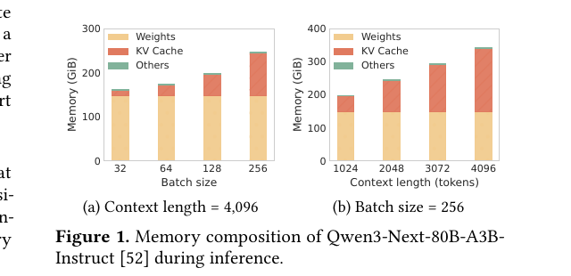

## 主线三子章节 2：专家驻留、预取与动态平衡

父章节：`7. 主线三：MoE 为什么会把 host-side orchestration 推到前台`

本子章节聚焦：

- `FluxMoE`、`FineMoE`、`SpecMoEOff` 分别解决什么
- 它们如何回答 residency、prefetch、skew 和 latency hiding

当前提纲要点：

- FluxMoE
- FineMoE
- SpecMoEOff

如果上一子章节说明了 MoE 的系统收益为什么不会自动出现，那么这一子章节需要回答的就是：工业和学术界究竟试图怎样把这些收益“救回来”。观察近一轮代表性工作，会发现它们虽然实现路径不同，但都在修复同一条链：`route -> place -> move -> overlap -> rebalance`。也就是说，MoE serving 的关键不再是单次门控选择本身，而是专家在什么地方常驻、何时预取、如何隐藏 miss、以及如何缓和热点偏斜。

`FluxMoE`、`FineMoE` 和 `SpecMoEOff` 可以被看作这条链上的三种典型回答。它们分别强调：

- 如何解耦“逻辑专家身份”和“物理驻留位置”；
- 如何利用访问轨迹和统计规律把专家更合理地放在层级结构中；
- 如何在专家真正被需要之前，利用推测和重叠把 miss 的代价藏起来。

这三者共同说明，MoE 的 host-side orchestration 已经不再是粗糙的“缺哪个专家就搬哪个专家”，而是在朝着更系统化的 residency control 演化。

先看 `FluxMoE`。它最关键的贡献不是再做一次更聪明的预测，而是改变问题的表述方式。传统思路很容易把专家驻留问题理解成“尽量猜准下一个要用哪个专家”，然后把更多精力放在预测是否准确上。`FluxMoE` 的出发点更接近系统现实：预测当然重要，但在复杂、波动和多租户的服务环境里，单靠高精度预测并不稳健。更现实的路径是把“逻辑专家身份”和“物理驻留位置”松绑，让系统能够在不同内存层级之间动态流式化专家参数，并通过更带宽均衡的层次结构降低单次 miss 的惩罚。

这个改变很重要，因为它把问题从“能否完美预测”转成“能否让不完美预测也不至于太贵”。对 CPU 而言，这意味着职责发生了实质变化。CPU 不再只是等待 gate 结果之后去被动触发加载，而要主动维护一幅更广的驻留视图：

- 哪些专家应常驻在 GPU HBM；
- 哪些专家可以停留在主机内存中等待快速流式化；
- 哪些专家最近变热，应该上移；
- 哪些专家变冷，应该下移或延后回收。

在这个框架下，`residency` 不再是简单的二元状态，而更像一个多层级连续控制问题。也正因为如此，MoE 与 KV lifecycle 之间开始出现明显耦合：它们都在争夺 GPU HBM、主机 DRAM、链路带宽和 CPU 决策预算。`FluxMoE` 的价值，正是在于它公开地承认了这种争夺，并试图用更灵活的层级策略来消化它。

### 0. 判断-证据对齐表

| 判断 | 直接支撑材料 | 关键数字或图 |
| --- | --- | --- |
| FluxMoE、FineMoE、SpecMoEOff 分别对应驻留解耦、细粒度预取和延迟隐藏三种路线 | `S008 S036 S037` | FluxMoE `3.0x`；SpecMoEOff `2.5x`；expert map / speculative offload 图 |
| MoE 的关键不是“缺哪个专家就搬哪个”，而是持续治理 route -> place -> move -> overlap -> rebalance 链 | `S008 S036 S037` | decoupled expert residency；trajectory-guided prefetch；speculative overlap |
| CPU 的新职责是维护驻留视图、热点预测和同步窗口，而非被动搬运 | `S008 S036 S037` | residency tiers；fine-grained residual modeling；latency hiding |

### 1. 本章核心判断

如果上一子章节说明了 MoE 的系统收益为什么不会自动出现，这一子章节要回答的就是：工业和学术界究竟怎样把这些收益“救回来”。观察近一轮代表性工作，会发现它们虽然实现路径不同，但都在修复同一条链：`route -> place -> move -> overlap -> rebalance`。也就是说，MoE serving 的关键不再是单次门控选择本身，而是专家在什么地方常驻、何时预取、如何隐藏 miss，以及如何缓和热点偏斜。[1][2][3]

### 2. FluxMoE：把“逻辑专家身份”和“物理驻留位置”解耦

`FluxMoE` 最关键的贡献不是再做一次更聪明的预测，而是改变问题表述方式。它公开承认：在复杂、波动和多租户的服务环境里，单靠“猜准下一个要用哪个专家”并不稳健；更现实的路径是把逻辑专家身份和物理驻留位置松绑，让系统能够在不同内存层级间动态流式化专家参数，并通过更带宽均衡的层次结构降低单次 miss 的惩罚。论文给出的最高结果是吞吐 `3.0x` over vLLM。[1]

这一步对 CPU 角色的意义很直接。CPU 不再是等待 gate 结果后触发一次加载，而要持续维护更广的驻留视图：

- 哪些专家应常驻在 GPU HBM；
- 哪些专家可停留在主机内存等待快速流式化；
- 哪些专家最近变热、应上移；
- 哪些专家变冷、应下移或延后回收。

### 图 1：FluxMoE 证明驻留控制本身就是一等系统对象

图 1 支撑的不是某个局部 trick，而是一个更根本的判断：MoE 收益要兑现，系统必须先显式管理“专家此刻在哪一层级”。[1]

### 3. FineMoE：把热点从“噪声”变成可建模结构

`FineMoE` 的意义更偏向“如何理解和利用访问结构”。它强调热点并不是纯随机噪声，而往往具有轨迹性和相似性。某些语义区域、任务类型和批结构会更高概率地重复激活相近专家集合。只要系统能够捕捉这种结构，CPU 就可以把专家放置和预取从“见招拆招”提升为“基于访问图谱的主动布局”。[2]

这一步的工程价值在于，它把动态平衡从事后补救前移到了事前规划：部分热点可以被提前平滑，部分冷 miss 可以被转化成低优先级背景动作，部分批内不均衡也可以在进入关键路径前被削弱。

### 4. SpecMoEOff：把 offload 延迟藏进推测与重叠

`SpecMoEOff` 则提供了第三条路线：不是保证永远不 miss，而是在专家真正被需要之前，用 speculative decoding 与 offloading overlap 把 miss 的代价藏起来。它给出的最高收益是 decode throughput `2.5x`。[3] 这说明工业与研究界已经不再假设“完全避免 miss”才是唯一目标，更现实的目标是：**即便 miss 发生，也尽量不要让它完整暴露在主路径上。**

### 图 2：speculative overlap 的价值在于把 miss 从关键路径中挪走

图 2 说明延迟隐藏已经成为 MoE control plane 的核心能力之一。它支撑本节的判断：CPU 不只是在管驻留，还在管“什么时候让状态移动不再阻塞 token 前进”。[3]

### 5. 这三条路线共同说明了什么

把三篇材料并列看，会得到一个很稳定的结论：

- `FluxMoE` 回答“专家应该怎样跨层级驻留”；
- `FineMoE` 回答“热点是否可以被提前感知并更细地预取”；
- `SpecMoEOff` 回答“即便 miss 发生，能否把它隐藏在重叠窗口里”。

三者共同说明，MoE 的 host-side orchestration 已经不再是粗糙的“缺哪个搬哪个”，而是在向更完整的 residency control 演化。

### 6. 小结

本节真正要立住的判断是：MoE 的下一代收益并不主要来自更聪明的 gate，而来自更聪明的驻留、预取与重叠。FluxMoE 的 `3.0x`、SpecMoEOff 的 `2.5x`，以及 FineMoE 对细粒度访问结构的建模，共同支撑一个稳健结论：**AI CPU 已经被推到需要持续维护专家状态图、热点预测与同步窗口的位置。**[1][2][3]

### 参考文献

[1] FluxMoE: Decoupling Expert Residency for High-Performance MoE Serving. 2026-04-03.

[2] FineMoE: Modeling Fine-Grained MoE Residuals for Expert Prefetching in Serving. 2026.

[3] SpecMoEOff: Accelerating Mixture-of-Experts Inference via Speculative Expert Offloading. 2025-08-29.

`SpecMoEOff` 则沿着另一条路线进一步推进，即承认 miss 总会发生，但尝试把其代价隐藏到系统本来就必须完成的其他工作背后。这条路线的思想和 KV 预取、resume overlap 很接近：如果无法完全避免状态迁移，那就争取让迁移不再暴露成前台等待。对 MoE 而言，这意味着利用投机、重叠或并行安排，把专家搬运和某些 token 计算、某些层间空隙或某些后台动作叠在一起。

这种思路很有现实意义，因为它不像完美预测那样要求环境高度稳定。即便热点变化较快、专家访问模式不完全规律，只要系统能够提前做出一定范围的保守推测，并让搬运与计算在时间上部分重叠，就有机会降低最坏 miss 对 TPOT 或尾延迟的破坏。也就是说，`SpecMoEOff` 并不是在让专家 miss 消失，而是在让 miss 从同步阻塞事件尽量转化成可被隐藏的后台动作。

把这三类工作放在一起看，就能更清楚地理解“专家驻留、预取与动态平衡”为什么是同一个问题的不同侧面。

`专家驻留` 关注的是状态现在放在哪里。  
`预取` 关注的是状态在真正被需要之前能否先到位。  
`动态平衡` 关注的是热点是否会长期偏向少数专家、少数 GPU 或少数链路。  
如果三者割裂处理，系统就会出现新的矛盾：

- 只看驻留，不看平衡，热点会迅速挤爆局部容量；
- 只看预取，不看驻留，预取出来的状态可能很快又被挤掉；
- 只看平衡，不看预取，系统可能为了均衡而付出过多前台迁移代价。

因此，MoE serving 真正需要的是一套统一的 `residency control loop`。在这套循环中，CPU 至少要完成以下动作：

1. 维护多层级 expert residency 视图；
2. 根据短期与中期热度决定提升、保留和回收；
3. 在已知或高概率将被访问的专家上触发预取；
4. 判断当前热点是否会造成局部链路、局部 GPU、局部 batch shard 失衡；
5. 在吞吐、尾延迟和带宽占用之间选择更合适的平衡策略。

这也说明，动态平衡并不是 MoE 的附属优化，而是它能否在生产中兑现收益的核心条件。如果没有平衡，热点专家会反复把系统拖回局部拥塞和同步放大；如果没有驻留控制，平衡只能靠前台迁移来完成，反而会进一步恶化尾延迟；如果没有预取和重叠，任何冷 miss 都可能把整条关键路径重新拉长。

对 agentic inference 来说，这个问题更敏感。因为 agentic workload 的 session 结构更复杂、任务类型切换更频繁、fan-out/fan-in 更剧烈，多代理或多分支往往意味着专家访问轨迹更容易瞬时变化。这样一来，静态的专家常驻集合更难长期有效，`residency` 和 `prefetch` 的策略价值就更高。CPU 在这里扮演的，不是简单的“专家仓库管理员”，而是持续观察流量形状、热点分布、容量压力与回合结构的协调者。

从工业吸收角度看，这也解释了为什么业界当前更愿意先吸收 `Wide Expert Parallelism`、平台级放置、拓扑组织和分层驻留这类思想，而不是立刻完全照搬某篇论文的具体算法。因为真正稳定可落地的，不是某个单点技巧，而是这套统一的控制逻辑：  
**专家应该被视为动态状态对象，而不是固定常量；CPU 应该围绕驻留、预取和热点平衡建立持续控制循环，而不是等 miss 发生后再救火。**

所以，本子章节最终要压缩出的判断是：  
`FluxMoE`、`FineMoE` 与 `SpecMoEOff` 虽然方法不同，但共同证明了 MoE serving 的核心工作已从“选择哪个专家”转向“如何让专家以可承受的方式出现在正确的位置”。这一步之所以关键，不是因为它让 gate 更聪明，而是因为它把 CPU 明确推成了 expert residency、prefetch 与 dynamic balance 的控制中心。
