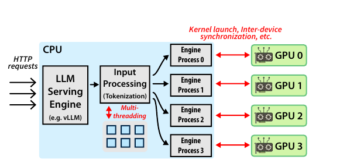
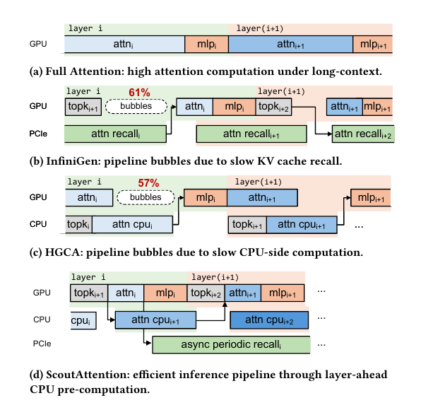
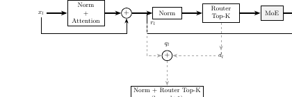
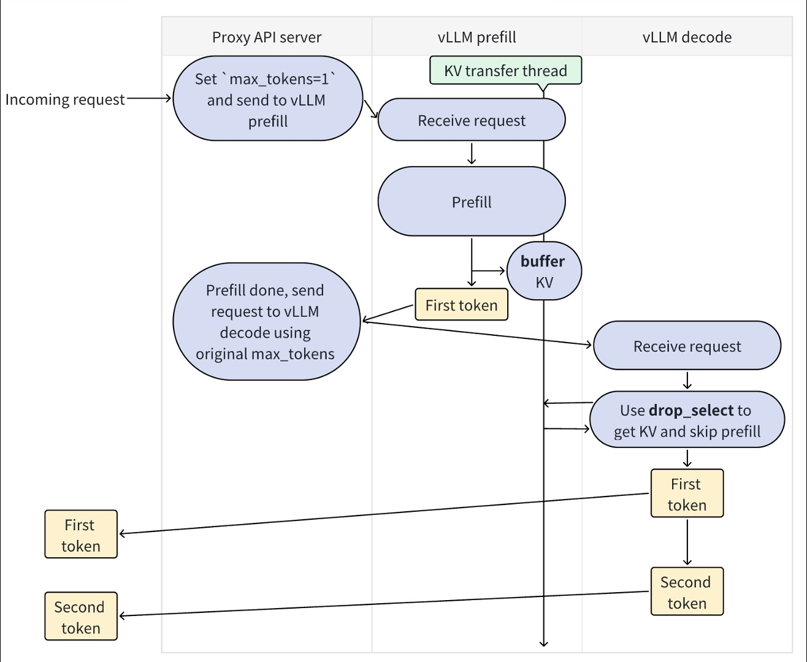
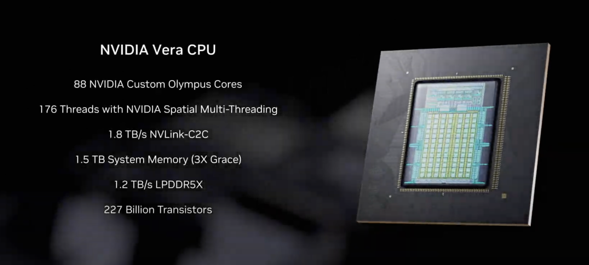

# Agentic AI 推理中机头 CPU 的系统作用

- 范围：只讨论 `agentic LLM inference` 对机头 CPU 的影响，不计入工具执行本身的 CPU 消耗
- 时间边界：主体证据采用 `2025-07-01` 及之后公开资料
- 主线：`算子下发`、`KV 生命周期`、`MoE 编排`、`真实工作负载`、`平台演化`

# 一页结论

- 机头 CPU 已从传统 host 演化为推理系统的第一层 `orchestrator`
- 关键稀缺资源不再只是 GPU FLOPS，而是 `host-side orchestration budget`
- CPU 压力的本质不是“算得慢”，而是控制链路变长：请求接入、阶段切换、状态放置、恢复、跨池传输、专家驻留都在抢占 host 预算
- `KV` 已从容量对象变成生命周期对象；`MoE` 减少激活计算但抬高了 host 编排价值
- `Prefill-as-a-Service` 说明 PD 分离正从单集群优化扩展为跨数据中心、带宽感知和 cache-aware 的 CPU 协调问题 [31]
- 平台路线图正在围绕 `CPU as orchestration plane` 收敛，CPU:GPU 预算开始重新分配

来源：[2][9][11][13][14][16][22][28]

# 中心命题与证据地图

| 命题 | 关键证据 | 系统含义 |
| --- | --- | --- |
| CPU 已进入推理关键路径 | CPU slowdown、PD 分离、KV read/write ratio、MoE orchestration [2][9][11][22] | GPU 上限越来越取决于 host 控制链路质量 |
| CPU 问题本质是控制链路过长 | persistent batch、CUDA graphs、KV transfer、decoupled residency [4][5][12][23] | 优化重点是减少同步控制动作 |
| KV 成为生命周期对象 | NOSA、ScoutAttention、CoMEM、coherent memory、CXL [6][7][8][10][15] | 状态分层、预取与恢复成为长期系统问题 |
| MoE 抬高 host 编排价值 | 宽专家并行、预测预取、驻留解耦 [11][12][28][30] | 稀疏激活降低计算量，但增加路由与搬运复杂度 |
| 平台围绕控制平面收敛 | Vera、Rubin、BlueField-4、CPU:GPU 配比变化 [13][14][16] | 平台开始显式为 host orchestration 让路 |

# 为什么 CPU 现在会变成关键变量

{ width=85% }

- 请求不再是单轮、连续、稳定的 decode 流
- 状态不再是一次性中间产物，而是需要保留、恢复、分叉和复用的长期对象
- GPU 不再只依赖本地 HBM，而要与 host memory、CXL、网络存储和跨节点 worker 协同
- 多代理、子会话和多模态 ingress 让 host 侧调度链路显著变长

来源：[9][22][24][26][27]

# 机制层之一：算子下发为何从开销变成瓶颈

{ width=42% }
{ width=42% }

- 量化、小模型和高并发会把 GPU 计算片段切得更碎，固定的 host 提交成本被放大 [2][3][4][5]
- 代表性数据：`301` 次 kernel launch，约 `750us` 纯下发税；fusion 后吞吐提升约 `20%` [3]
- 多 GPU serving 中，host 抖动会被同步机制放大：dequeue 延迟可从 `12 ms` 恶化到 `228 ms`，约 `19x` [2]
- 在 agentic inference 中，请求更像“多次被暂停、恢复、重入的推理片段”，host 必须频繁处理 `stage transition`、`context placement` 和 `resume`
- `Prefill-as-a-Service` 进一步把这条链延伸到跨域：远端 prefill、KV 回传、prefix cache 感知放置和带宽感知调度都落在 host 控制面 [31]
- 有效优化共同目标不是提高 CPU 算力，而是减少 `host touch frequency / jitter`

# 机制层之二：KV 为何从容量问题变成生命周期问题

{ width=42% }
{ width=42% }

- 最关键证据不是“KV 很大”，而是访问模式变了：`read/write ratio = 11.7x`，系统更像在“恢复旧状态”而不是“持续写新状态” [9]
- KV 不再只是上下文副产物，而是可跨轮次保留、可跨 worker 转移、可被多个子代理复用的长期状态
- `NOSA` 最高 `5.04x` 解码吞吐提升，`ScoutAttention` 约 `2.1x` 加速且精度损失 < `2.4%` [6][7]
- CPU 角色已从“搬运工”变成 `warm-tier manager`：负责 placement、prefetch 和 resume path control
- 机头 CPU 选型关键指标转向：主机内存带宽、一致性互连、NUMA 摩擦、大容量内存挂接能力、恢复路径尾延迟

# KV 分层经济学与部署含义

{ width=40% }
{ width=40% }

- 现代状态层级不应再简化为 `HBM vs DRAM`，而是：`HBM -> coherent CPU memory -> host DRAM -> CXL -> storage`
- CXL 的意义不是单纯扩容，而是把两层内存策略升级为多层状态策略 [10][15][29]
- 代表性产业建模：GPU 需求下降 `87%`、GPU 利用率提升 `75%`、CPU 利用率下降 `40%`、并发实例约 `2x` [15]
- 关键问题不再是“能不能放下”，而是“热对象留在哪、冷对象放到哪、即将恢复对象何时拉回”
- 结论：CPU 不只是承载层，而是状态层级决策与迁移执行的中心

# 机制层之三：MoE 为何把 host 编排推到前台

{ width=42% }
{ width=42% }

- MoE 节省的是每 token 激活计算，不是系统编排复杂度
- 一旦 expert 总量超出单节点 GPU 驻留能力，系统压力迅速集中到三处：`expert routing`、`weight residency/prefetch`、`collective orchestration`
- `Speculating Experts` 通过预测预取把同步搬运改成异步路径，TPOT 下降约 `14%` [11]
- `FluxMoE` 通过 `decoupled residency` 把逻辑 expert 身份与物理驻留位置分离 [12]
- MoE 在 agentic workload 下会与 KV 生命周期竞争同一组 host 预算：内存带宽、恢复窗口、调度优先级、跨层传输机会

# 场景层验证：真实工作负载如何放大 CPU 压力

{ width=52% }

| 工作负载修正 | 对应 CPU 压力 | 最容易被低估的点 |
| --- | --- | --- |
| `prefill-first` | 高频输入重整、batch 重组、worker 选择 | host 比 GPU 更早被打满 |
| `session multiplicity` | per-session queue、admission control、placement | 难点不是单上下文太长，而是活跃上下文太多 |
| `fan-out/fan-in burst` | 瞬时宽并发、聚合调度、尾延迟控制 | 平均吞吐无法描述真实压力 |
| `multimodal ingress` | 输入准备、会话绑定、状态更新 | 视觉/界面状态重入会放大 prefill churn |

来源：[22][24][25][26][27]

# 案例化对比：四类 agentic 产品形态

| 案例 | 公开形态特征 | 对应的推理侧 CPU 约束 | 最容易被低估的点 |
| --- | --- | --- | --- |
| `Claude Code subagents` | 子代理独立上下文、按任务拆分 | `session multiplicity`、resume、placement | 不是单上下文太长，而是同时活跃 context 太多 |
| `Kimi Swarm` | 多 agent 并行、分解后再聚合 | `fan-out/fan-in burst`、admission control | 压力来自瞬时宽并发和汇聚尾延迟 |
| `OpenClaw` | 常驻、多入口、移动/视觉交互 | `multimodal prefill churn`、状态切换 | 视觉状态重入会拉高 prefill 频率 |
| `Mobile Use Agent` | 手机 GUI、多模态交互、链式推进 | 高频 prefill、短 decode、resume-heavy | 即便不算操作执行，视觉输入重入也会放大 host 排队 |

结论：产品表面不同，但最终都把压力汇聚到 `session scheduling`、`prefill orchestration`、`resume latency`、`burst handling`

# 平台层验证：平台为何围绕 CPU 控制平面重组

{ width=40% }
{ width=40% }

- Vera 关键信号：`88` 个 Arm 核、`1.2 TB/s` LPDDR5X 带宽、`1.8 TB/s` NVLink-C2C [13][14][17]
- 含义不是“CPU 又成了主角”，而是平台承认控制平面会反复进入推理关键路径
- 一体化平台把 CPU、GPU、DPU、交换结构组织成更低抖动的整体链路，以降低状态迁移和阶段切换摩擦 [14][22][28]
- CPU:GPU 配比正在从 `1:4–1:8` 向 `1:1–1:2` 演进，反映的是“GPU 进步快于控制平面进步”的系统失衡 [16][18][19][20][21]
- 平台层的真正变化不是“CPU 更强”，而是“CPU 更靠前”

# 工程落地：部署分层与 CPU 选型

{ width=35% }

| 节点角色 | 主要关注点 | 更像什么节点 |
| --- | --- | --- |
| `co-located GPU node` | 近端一致性互连、主机内存带宽、恢复路径延迟 | 执行+恢复 |
| `prefill-heavy ingress node` | 高频 prefill 调度稳定性、输入处理能力 | 前端控制 |
| `capacity-oriented state node` | 大容量 host memory、CXL、分层成本 | 状态管理 |
| `coordination-heavy swarm node` | 多会话调度、burst handling、尾延迟隔离 | 协调密集 |
| `remote prefill service node` | 长上下文 prefill 吞吐、跨域带宽感知调度、prefix cache 感知放置 | 远端 prefill 服务 |

- 部署建议不是经验清单，而是由前文机制链直接推导出的工程约束
- DPU / SuperNIC 的价值在于给 CPU 让路：把网络、存储、安全数据面旁路出去，释放推理控制预算 [14][22]
- CPU 选型关键问题：是否 `prefill-heavy` / `resume-heavy`；是否把 host memory 当 warm tier；是否存在大量 `session multiplicity` 或 `fan-out/fan-in burst`

# 评测与研究议程

| 评测维度 | 要测什么 | 对应机制 |
| --- | --- | --- |
| `dispatch latency` | 请求进入到 GPU 有效开算之间的 host 延迟 | 算子下发 |
| `resume latency` | 状态从 warm/cold tier 恢复回计算路径的延迟 | KV 生命周期 |
| `session concurrency quality` | 多会话并存时的公平性与尾延迟 | 真实 workload |
| `burst robustness` | fan-out/fan-in 宽并发下的退化曲线 | 场景层验证 |
| `tiering efficiency` | KV / expert / context 在多层内存中的放置与迁移效率 | KV + MoE |

- 当前研究三条断层：`产品到机制`、`平台到软件`、`局部优化到系统目标`
- 后续议程：建立 `agentic inference host benchmark`，研究 `state-centric scheduling`、`control-plane-aware serving`、`platform-software co-design`

# 关键数据总表

| 主题 | 关键数据点 | 含义 |
| --- | --- | --- |
| 算子下发 | `301` 次 kernel launch，约 `750us` 纯下发税，fusion 后吞吐约 `+20%` [3] | 小模型与量化场景下，host 固定成本迅速成为上限 |
| CPU 抖动 | dequeue 延迟从 `12 ms` 恶化到 `228 ms`，约 `19x` [2] | CPU oversubscription 可放大为集群级停顿 |
| 推理引擎优化 | vLLM V1 吞吐相对 V0 最高约 `1.7x` [5] | 大量收益来自减少 CPU 调度和 Python 开销 |
| KV 访问模式 | KV read/write ratio `11.7x` [9] | 更像状态恢复问题，而非单纯写入问题 |
| KV 卸载 | NOSA 最高 `5.04x` 解码吞吐提升 [6] | 减少 CPU-GPU KV 传输是核心收益 |
| 协同式卸载 | ScoutAttention 约 `2.1x` 加速，精度损失 < `2.4%` [7] | CPU 可从搬运者变成协同计算者 |
| CXL 分层 | GPU 需求 `-87%`，GPU 利用率 `+75%`，CPU 利用率 `-40%` [15] | KV 分层已进入容量-性能-成本联合优化 |
| MoE 预取 | TPOT 下降约 `14%` [11] | expert 预取能把同步搬运改成异步路径 |
| Prefill-as-a-Service | 相对同构 PD 吞吐 `+54%`，相对朴素异构基线 `+32%` [31] | PD 分离正扩展为跨数据中心和 cache-aware 的 CPU 协调问题 |
| 平台规格 | Vera 内存带宽 `1.2 TB/s`，NVLink-C2C `1.8 TB/s` [13] | 平台已按 CPU 控制平面需求组织 |
| 产业配比 | CPU:GPU 由 `1:4–1:8` 向 `1:1–1:2` 演进 [16] | 部署预算开始向 host 侧回流 |

# 结论

- `agentic inference` 并未削弱 GPU 的重要性，而是改变了 GPU 发挥价值的前提
- 机头 CPU 的新位置不是“辅助计算”，而是 `dispatch + tiering + transfer + coordination`
- 只要系统继续沿着多阶段、多代理、多模态和长生命周期方向发展，CPU 就会持续停留在关键路径
- 因此，后续优化不应只围绕“更快的 GPU”，而应围绕“更稳定的控制平面”

来源：综合 [2][9][11][13][14][22][24][28]
